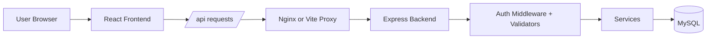
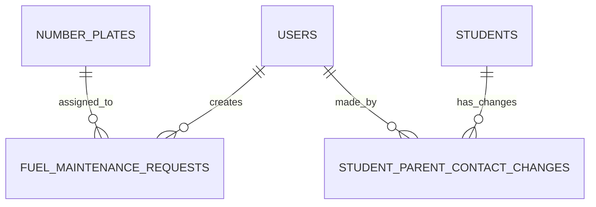

# Soho Transport Management System

Role-based school transport management platform with:
- Node.js + Express backend
- React + TypeScript + Vite frontend
- MySQL database

The app supports multiple user roles and dashboard experiences:
- Parent
- Driver
- Bus Assistant
- Transport Manager
- School Admin

## Table of Contents
1. Project Overview
2. Current Feature Set
3. Tech Stack
4. Repository Structure
5. Local Development Setup
6. Environment Variables
7. Database Setup and Seeding
8. Running the Application
9. API Reference
10. Frontend Routing and UI Behavior
11. Authentication and Authorization Model
12. Data Model (Database Tables)
13. Troubleshooting
14. Known Limitations
15. Security Notes
16. Postman Collection and Examples
17. Architecture Diagrams
18. Deployment Guides

## Project Overview
This repository contains a transport management system focused on role-specific workflows:
- Authentication (register, login, refresh, logout, me)
- Role-aware dashboard navigation and content
- Driver fuel and maintenance request workflow
- School admin student lifecycle workflow

The frontend is a single-page app protected by auth gating. The backend exposes REST APIs under `/api/*` and uses JWT access tokens with refresh tokens in HTTP-only cookies.

## Current Feature Set
### Cross-role
- Role-based dashboard shell (sidebar, header, content panel)
- Mobile sidebar with hamburger toggle
- Sidebar logout action
- Welcome header message derived from logged-in user details

### Auth
- Registration with role selection
- Number plate assignment required for Driver and Bus Assistant during registration
- Login with JWT access token + refresh token cookie
- Auth-protected routes in frontend
- Backend role-based route guards

### Driver
- Driver menu sections (Dashboard, Attendance, Fuel & Maintenance, Compliants & Reports, etc.)
- Fuel & Maintenance request form with:
  - Date
  - Number plate (locked to assigned driver plate)
  - Mileage
  - Request type
  - Category
  - Description
  - Conditional amount (required for Fuel)
  - Confirmed by (restricted to fixed options)
- Fuel request history list for logged-in driver
- Backend enforcement that a driver can only submit requests for their assigned number plate

### School Admin
- Student dashboard data retrieval
- Student admission creation
- Parent contact update with change logging
- Student withdrawal recording
- Student master-data update

## Tech Stack
### Frontend
- React 19
- TypeScript
- React Router
- Vite
- CSS modules and component-scoped CSS files

### Backend
- Node.js
- Express 5
- mysql2
- bcrypt
- jsonwebtoken
- express-validator
- helmet
- cors
- cookie-parser
- morgan

### Database
- MySQL (InnoDB, foreign keys)

## Repository Structure
```text
Soho/
├── backend/
│   ├── server.js
│   ├── .env.example
│   └── src/
│       ├── app.js
│       ├── config/db.js
│       ├── migration/schema.sql
│       ├── utils/token.js
│       ├── middlewares/auth.middleware.js
│       ├── routes/
│       │   ├── auth.routes.js
│       │   ├── fuelMaintenance.routes.js
│       │   └── student.routes.js
│       ├── controllers/
│       │   ├── auth.controller.js
│       │   ├── fuelMaintenance.controller.js
│       │   └── student.controller.js
│       ├── validators/
│       │   ├── auth.validators.js
│       │   ├── fuelMaintenance.validators.js
│       │   └── student.validators.js
│       └── services/
│           ├── auth.service.js
│           ├── fuelMaintenance.service.js
│           └── student.service.js
├── frontend/
│   ├── package.json
│   ├── vite.config.ts
│   ├── .env.example
│   └── src/
│       ├── App.tsx
│       ├── contexts/AuthContext.tsx
│       ├── lib/api.ts
│       └── components/
│           ├── Auth/
│           ├── Layout/
│           ├── SideBar/
│           ├── DashboardHeader/
│           ├── ProtectedRoute/
│           └── Dashboard/
└── docker-compose.yml
```

## Local Development Setup
### 1) Prerequisites
- Node.js 18+ (recommended 20+)
- npm 9+
- MySQL 8+

### 2) Install dependencies
```bash
cd backend
npm install

cd ../frontend
npm install
```

### 3) Configure environment files
Backend:
```bash
cp backend/.env.example backend/.env
```

Frontend:
```bash
cp frontend/.env.example frontend/.env
```

### 4) Create database and apply schema
```bash
mysql -u root -p -e "CREATE DATABASE IF NOT EXISTS soho_transport;"
mysql -u root -p soho_transport < backend/src/migration/schema.sql
```

### 5) Seed number plates (required for Driver/Bus Assistant registration)
Example:
```sql
INSERT INTO number_plates (plate_number, status)
VALUES
  ('KDA123A', 'active'),
  ('KDB456B', 'active'),
  ('KDC789C', 'inactive');
```

## Environment Variables
### Backend (`backend/.env`)
Based on `backend/.env.example`:

```env
DB_HOST=localhost
DB_USER=root
DB_PASSWORD=
DB_NAME=soho_transport

JWT_SECRET=your-super-secret-jwt-key-change-this-in-production
JWT_EXPIRES_IN=15m
JWT_REFRESH_SECRET=your-super-secret-refresh-key-change-this-in-production
JWT_REFRESH_EXPIRES_IN=7d

PORT=3001
NODE_ENV=development
FRONTEND_ORIGIN=http://localhost:5173
```

Important:
- `server.js` defaults to port `5000` if `PORT` is not set.
- Keep frontend backend target aligned with backend port.

### Frontend (`frontend/.env`)
Based on `frontend/.env.example`:

```env
VITE_BACKEND_URL=http://localhost:5000
# Optional:
# VITE_API_BASE_URL=http://localhost:5000/api
```

Behavior:
- `VITE_BACKEND_URL` is used by Vite dev proxy (`/api` -> backend).
- `VITE_API_BASE_URL` can override API base directly in the frontend client.

## Database Setup and Seeding
Schema file:
- `backend/src/migration/schema.sql`

Tables created:
- `users`
- `number_plates`
- `fuel_maintenance_requests`
- `students`
- `student_parent_contact_changes`

Notes:
- Services call table-ensure logic (`CREATE TABLE IF NOT EXISTS`) before operations.
- This is not a full migration framework. For controlled schema evolution across environments, use a dedicated migration tool in production.

## Running the Application
### Backend
```bash
cd backend
npm run dev
```
or
```bash
cd backend
npm start
```

### Frontend
```bash
cd frontend
npm run dev
```

Default URLs:
- Frontend: `http://localhost:5173`
- Backend: `http://localhost:5000` (or your `PORT`)

Health check:
- `GET /health`

### Build frontend
```bash
cd frontend
npm run build
```

### Docker (frontend only)
From repository root:
```bash
docker compose up --build
```

Production profile:
```bash
docker compose --profile prod up --build frontend-prod
```

## API Reference
Base backend URL examples below assume `http://localhost:5000`.

Response envelope pattern:
```json
{
  "success": true,
  "message": "Human-readable message",
  "data": {}
}
```

Validation errors pattern:
```json
{
  "success": false,
  "message": "Validation failed.",
  "errors": [
    { "field": "email", "message": "Invalid email format." }
  ]
}
```

## Auth Endpoints
### `POST /api/auth/register`
Creates a new user.

Request body:
```json
{
  "email": "driver@example.com",
  "firstName": "Simon",
  "lastName": "Mwangi",
  "phoneNumber": "0712345678",
  "numberPlate": "KDA123A",
  "role": "Driver",
  "password": "secret123"
}
```

Notes:
- `numberPlate` is required for `Driver` and `Bus Assistant`.
- `numberPlate` must exist in `number_plates` with `status='active'`.

### `POST /api/auth/login`
Authenticates user and returns access token + sets refresh token cookie.

Request body:
```json
{
  "email": "driver@example.com",
  "password": "secret123"
}
```

Success payload includes:
- `email`
- `firstName`
- `lastName`
- `role`
- `numberPlate`
- `token` and `accessToken`
- `refreshToken`

### `POST /api/auth/refresh`
Refreshes session using refresh token from cookie or body.

### `GET /api/auth/me`
Requires bearer token.

### `POST /api/auth/logout`
Clears refresh cookie.

### `GET /api/auth/number-plates`
Returns active number plates.

## Fuel & Maintenance Endpoints (Driver only)
All routes require:
- Bearer access token
- Role: `Driver`

### `GET /api/fuel-maintenance/requests`
Lists requests created by authenticated driver.

### `POST /api/fuel-maintenance/requests`
Creates fuel/maintenance request.

Request body:
```json
{
  "requestDate": "2026-02-20",
  "numberPlate": "KDA123A",
  "currentMileage": 143250,
  "requestType": "Fuel",
  "requestedBy": "Simon Mwangi",
  "category": "Fuels & Oils",
  "description": "Refueling for morning route",
  "amount": 12000,
  "confirmedBy": "Erick"
}
```

Validation/Business rules:
- `requestType` in:
  - `Fuel`
  - `Service`
  - `Repair and Maintenance`
  - `Compliance`
- `category` in:
  - `Fuels & Oils`
  - `Body Works and Body Parts`
  - `Mechanical`
  - `Wiring`
  - `Puncture & Tires`
  - `Insurance`
  - `RSL`
  - `Inspection / Speed Governors`
- `confirmedBy` in:
  - `Erick`
  - `Douglas`
  - `James`
- `amount` required and > 0 when `requestType = Fuel`
- Driver can only submit for assigned `numberPlate`

## Student Endpoints (School Admin only)
All routes require:
- Bearer access token
- Role: `School Admin`

### `GET /api/students`
Returns:
- `students`
- `admissions` (active students)
- `withdrawals` (withdrawn students)
- `parentContactChanges`
- `summary` counts

### `POST /api/students/admissions`
Create student admission.

### `PATCH /api/students/:studentId/parent-contact`
Update parent contact and log change in `student_parent_contact_changes`.

### `PATCH /api/students/:studentId/withdrawal`
Mark student as withdrawn.

### `PATCH /api/students/:studentId/master-data`
Update one or more of:
- `admissionNumber`
- `firstName`
- `lastName`
- `className`
- `grade`
- `admissionDate`

## Postman Collection and Examples
Postman assets are included in this repository:

- Collection:
  - `docs/postman/Soho-Transport-API.postman_collection.json`
- Environment:
  - `docs/postman/Soho-Transport-Local.postman_environment.json`

The collection contains request and example response payloads for every current backend endpoint:
- `GET /health`
- Auth endpoints
- Driver fuel and maintenance endpoints
- School admin student endpoints

### Import into Postman
1. Open Postman.
2. Click `Import`.
3. Import both files from `docs/postman/`.
4. Select environment `Soho Transport Local`.
5. Run `Auth > Login` first to auto-store `accessToken`.

Variables included in the environment:
- `baseUrl` (default `http://localhost:5000`)
- `accessToken`
- `refreshToken`
- `studentId`
- `userEmail`

## Architecture Diagrams
Detailed diagrams:
- `docs/architecture/ARCHITECTURE.md`

### Request/Control Flow


### Database Relationship Diagram


## Deployment Guides
Deployment documentation:
- `docs/deployment/DEPLOYMENT.md`

Deployment templates included:
- PM2 config:
  - `deploy/pm2/ecosystem.config.cjs`
- Nginx (PM2/VPS style):
  - `deploy/nginx/soho.conf`
- Docker full stack:
  - `deploy/docker/docker-compose.prod.yml`
  - `deploy/docker/backend.Dockerfile`
  - `deploy/docker/nginx.Dockerfile`
  - `deploy/docker/nginx.conf`
  - `deploy/docker/.env.prod.example`

### Quick Start (Docker Full Stack)
```bash
cd deploy/docker
cp .env.prod.example .env.prod
docker compose --env-file .env.prod -f docker-compose.prod.yml up -d --build
```

### Quick Start (PM2 + Nginx)
```bash
# Backend
cd /var/www/soho/backend
npm ci --omit=dev
pm2 start /var/www/soho/deploy/pm2/ecosystem.config.cjs

# Frontend
cd /var/www/soho/frontend
npm ci && npm run build

# Nginx
sudo cp /var/www/soho/deploy/nginx/soho.conf /etc/nginx/sites-available/soho.conf
sudo ln -s /etc/nginx/sites-available/soho.conf /etc/nginx/sites-enabled/soho.conf
sudo nginx -t && sudo systemctl reload nginx
```

## Frontend Routing and UI Behavior
Main routes:
- Public:
  - `/login`, `/register`
  - plus aliases like `/auth/login`, `/auth/register`, `/signin`, `/signup`
- Protected:
  - `/dashboard` and role aliases (`/driver`, `/parent`, `/assistant`, etc.)

Behavior:
- `ProtectedRoute` redirects unauthenticated users to `/login`.
- Sidebar menu controls active dashboard section.
- Dashboard header displays:
  - Welcome message using logged-in user first name
  - Active section title/description
  - Role badge on right
- Logout action is in sidebar (`Door + Logout` button).
- Layout content area (`.layout__content`) uses smooth scrolling.

## Authentication and Authorization Model
### Token model
- Access token:
  - Sent as `Authorization: Bearer <token>`
  - Used by backend auth middleware
- Refresh token:
  - Stored in HTTP-only cookie (`/api/auth` path)
  - Used by `/api/auth/refresh`

### Authorization
- Role guard middleware checks allowed roles per route.
- Driver-only APIs:
  - `/api/fuel-maintenance/*`
- School Admin-only APIs:
  - `/api/students/*`

### Frontend auth state note
Current `AuthContext` behavior intentionally clears local storage on app startup, forcing a fresh login each restart/reload.

## Data Model (Database Tables)
### `users`
- Identity and role fields
- `numberPlate` nullable, used for Driver/Bus Assistant assignment

### `number_plates`
- Plate inventory
- `status` active/inactive

### `fuel_maintenance_requests`
- Request details, category/type enums, amount
- FK to `users.id` (`createdByUserId`)
- FK to `number_plates.plate_number` (`numberPlate`)

### `students`
- Admission and lifecycle state
- `status` active/withdrawn

### `student_parent_contact_changes`
- Audit trail for contact updates
- FK to `students.id`
- FK to `users.id` (`changedByUserId`)

## Troubleshooting
### Frontend cannot reach backend
Check:
- Backend is running
- `VITE_BACKEND_URL` matches backend URL/port
- Backend `FRONTEND_ORIGIN` matches frontend URL

### CORS errors
Set `FRONTEND_ORIGIN` in backend `.env` to your frontend origin (for example `http://localhost:5173`).

### Driver registration fails with number plate error
Ensure selected plate exists and is active in `number_plates`.

### Driver fuel request rejected for number plate mismatch
The backend enforces that driver can submit only for assigned plate in `users.numberPlate`.

### `Validation failed` responses
Inspect `errors[]` in API response; each item contains `field` and `message`.

## Known Limitations
- No automated test suite currently configured.
- No formal migration tooling (schema file + runtime table ensures only).
- Root `docker-compose.yml` defines frontend-focused services; full-stack production compose is under `deploy/docker/`.
- Number plate management endpoint for admins is not implemented yet (manual DB seeding required).

## Security Notes
- Passwords are hashed with bcrypt.
- Helmet is enabled for secure HTTP headers.
- Input validation uses express-validator.
- SQL queries use parameterized statements.
- Refresh token cookie is HTTP-only and uses `secure` in production mode.

For additional security-specific notes, see `SECURITY.md`.
