# 🚌 Soho Transport Management System

<div align="center">


*A comprehensive role-based school transport management platform for coordinating vehicles, routes, drivers, bus assistants, students, parents, requests, incidents, compliance documents, and transport operations.*

</div>

---

## 📋 Table of Contents

- [🌟 Overview](#-overview)
- [🚀 Quick Start](#-quick-start)
- [🔧 Tech Stack](#-tech-stack)
- [👥 User Roles](#-user-roles)
- [✨ Features](#-features)
- [🚐 Vehicle-Route Assignments & Automation](#-vehicle-route-assignments--automation)
- [🤖 Trip Generation Service](#-trip-generation-service)
- [📁 Project Structure](#-project-structure)
- [🏗️ Architecture](#️-architecture)
- [📊 Database Schema](#-database-schema)
- [🚢 API Documentation](#-api-documentation)
- [🔐 Security](#-security)
- [🧪 Testing](#-testing)
- [📦 Deployment](#-deployment)
- [🤝 Contributing](#-contributing)
- [📄 License](#-license)

---

## 🌟 Overview

Soho is a **complete school transport management solution** that streamlines the coordination of vehicles, routes, drivers, students, and parents. The system provides real-time tracking, automated scheduling, incident management, and comprehensive reporting.

### 🎯 Key Capabilities

| Feature | Description |
|---------|-------------|
| 🚌 **Fleet Management** | Vehicle inventory, maintenance scheduling, compliance tracking |
| 🗺️ **Route Planning** | Intelligent route optimization, stop management, GPS tracking |
| 👨‍👩 **Student Safety** | Real-time attendance tracking, parent notifications, emergency alerts |
| 👥 **Staff Management** | Driver scheduling, assistant assignments, performance tracking |
| ⛽ **Fuel Management** | Fuel consumption monitoring, cost analysis, mileage tracking |
| 📊 **Analytics** | Comprehensive reporting, operational insights, trend analysis |
| 🔔 **Communication** | Automated notifications, announcements, messaging system |

---

## 🚀 Quick Start

### Prerequisites

- **Node.js** 18+ (20+ recommended)
- **npm** 9+
- **MySQL** 8+
- **Git**

### Installation Steps

#### 1️⃣ Clone Repository

```bash
git clone https://github.com/DeCLAN-designs/Soho_Academy.git
cd Soho
```

#### 2️⃣ Install Dependencies

```bash
# Backend
cd backend
npm install

# Frontend
cd ../frontend
npm install
```

#### 3️⃣ Configure Environment

```bash
# Backend
cd backend
cp .env.example .env
# Edit .env with your database credentials

# Frontend  
cd ../frontend
cp .env.example .env
# Edit .env with your API URLs
```

#### 4️⃣ Database Setup

```bash
# Create database
mysql -u root -p -e "CREATE DATABASE IF NOT EXISTS Soho_Academy;"

# Apply schema
mysql -u root -p Soho_Academy < backend/src/migration/mainschema.sql
```

#### 5️⃣ Start Development Servers

```bash
# Terminal 1: Backend
cd backend
npm run dev

# Terminal 2: Frontend
cd frontend
npm run dev
```

#### 6️⃣ Access Application

- **Frontend**: http://localhost:5173
- **Backend API**: http://localhost:5000/api
- **Health Check**: http://localhost:5000/health

---

## 🔧 Tech Stack

### Frontend Stack

<div align="center">

| Technology | Version | Purpose |
|------------|---------|---------|
|  | 19.x | UI Framework |
|  | 5.x | Static Typing |
|  | 5.x | Build Tool |
|  | 6.x | Routing |
|  | 1.x | HTTP Client |
|  | Latest | Progressive Web App |

</div>

### Backend Stack

<div align="center">

| Technology | Version | Purpose |
|------------|---------|---------|
|  | 20.x | Runtime |
|  | 5.x | Web Framework |
|  | 8.x | Database |
|  | Latest | Authentication |
|  | Latest | Password Hashing |
|  | Latest | File Uploads |

</div>

### DevOps & Infrastructure

<div align="center">

| Technology | Purpose |
|------------|---------|
|  | Containerization |
|  | Reverse Proxy |
|  | Process Manager |
|  | File Storage |
|  | Caching |

</div>

---

## 👥 User Roles

### Role Matrix

<div align="center" style="overflow-x: auto;">
  <table style="width: 100%; border-collapse: collapse; text-align: center;">
    <thead>
      <tr style="background-color: #f6f8fa;">
        <th style="padding: 10px; border: 1px solid #dfe2e5;">Feature</th>
        <th style="padding: 10px; border: 1px solid #dfe2e5;">👨‍👩 Parent</th>
        <th style="padding: 10px; border: 1px solid #dfe2e5;">🚗 Driver</th>
        <th style="padding: 10px; border: 1px solid #dfe2e5;">🚐 Assistant</th>
        <th style="padding: 10px; border: 1px solid #dfe2e5;">🏢 Transport Manager</th>
        <th style="padding: 10px; border: 1px solid #dfe2e5;">🏫 School Admin</th>
        <th style="padding: 10px; border: 1px solid #dfe2e5;">⛽ Fuel Manager</th>
      </tr>
    </thead>
    <tbody>
      <tr>
        <td style="padding: 8px; border: 1px solid #dfe2e5; font-weight: bold;">Children Management</td>
        <td style="padding: 8px; border: 1px solid #dfe2e5;">✅</td>
        <td style="padding: 8px; border: 1px solid #dfe2e5;">❌</td>
        <td style="padding: 8px; border: 1px solid #dfe2e5;">❌</td>
        <td style="padding: 8px; border: 1px solid #dfe2e5;">❌</td>
        <td style="padding: 8px; border: 1px solid #dfe2e5;">✅</td>
        <td style="padding: 8px; border: 1px solid #dfe2e5;">❌</td>
      </tr>
      <tr style="background-color: #fbfcfd;">
        <td style="padding: 8px; border: 1px solid #dfe2e5; font-weight: bold;">Transport Calendar</td>
        <td style="padding: 8px; border: 1px solid #dfe2e5;">❌</td>
        <td style="padding: 8px; border: 1px solid #dfe2e5;">❌</td>
        <td style="padding: 8px; border: 1px solid #dfe2e5;">❌</td>
        <td style="padding: 8px; border: 1px solid #dfe2e5;">✅</td>
        <td style="padding: 8px; border: 1px solid #dfe2e5;">✅</td>
        <td style="padding: 8px; border: 1px solid #dfe2e5;">❌</td>
      </tr>
      <tr>
        <td style="padding: 8px; border: 1px solid #dfe2e5; font-weight: bold;">Route Planning</td>
        <td style="padding: 8px; border: 1px solid #dfe2e5;">❌</td>
        <td style="padding: 8px; border: 1px solid #dfe2e5;">❌</td>
        <td style="padding: 8px; border: 1px solid #dfe2e5;">❌</td>
        <td style="padding: 8px; border: 1px solid #dfe2e5;">✅</td>
        <td style="padding: 8px; border: 1px solid #dfe2e5;">❌</td>
        <td style="padding: 8px; border: 1px solid #dfe2e5;">❌</td>
      </tr>
      <tr style="background-color: #fbfcfd;">
        <td style="padding: 8px; border: 1px solid #dfe2e5; font-weight: bold;">Vehicle Management</td>
        <td style="padding: 8px; border: 1px solid #dfe2e5;">❌</td>
        <td style="padding: 8px; border: 1px solid #dfe2e5;">❌</td>
        <td style="padding: 8px; border: 1px solid #dfe2e5;">❌</td>
        <td style="padding: 8px; border: 1px solid #dfe2e5;">✅</td>
        <td style="padding: 8px; border: 1px solid #dfe2e5;">❌</td>
        <td style="padding: 8px; border: 1px solid #dfe2e5;">❌</td>
      </tr>
      <tr>
        <td style="padding: 8px; border: 1px solid #dfe2e5; font-weight: bold;">Staff Management</td>
        <td style="padding: 8px; border: 1px solid #dfe2e5;">❌</td>
        <td style="padding: 8px; border: 1px solid #dfe2e5;">❌</td>
        <td style="padding: 8px; border: 1px solid #dfe2e5;">❌</td>
        <td style="padding: 8px; border: 1px solid #dfe2e5;">✅</td>
        <td style="padding: 8px; border: 1px solid #dfe2e5;">❌</td>
        <td style="padding: 8px; border: 1px solid #dfe2e5;">❌</td>
      </tr>
      <tr style="background-color: #fbfcfd;">
        <td style="padding: 8px; border: 1px solid #dfe2e5; font-weight: bold;">Trip Management</td>
        <td style="padding: 8px; border: 1px solid #dfe2e5;">❌</td>
        <td style="padding: 8px; border: 1px solid #dfe2e5;">✅</td>
        <td style="padding: 8px; border: 1px solid #dfe2e5;">✅</td>
        <td style="padding: 8px; border: 1px solid #dfe2e5;">✅</td>
        <td style="padding: 8px; border: 1px solid #dfe2e5;">❌</td>
        <td style="padding: 8px; border: 1px solid #dfe2e5;">❌</td>
      </tr>
      <tr>
        <td style="padding: 8px; border: 1px solid #dfe2e5; font-weight: bold;">Attendance Tracking</td>
        <td style="padding: 8px; border: 1px solid #dfe2e5;">View</td>
        <td style="padding: 8px; border: 1px solid #dfe2e5;">✅</td>
        <td style="padding: 8px; border: 1px solid #dfe2e5;">✅</td>
        <td style="padding: 8px; border: 1px solid #dfe2e5;">✅</td>
        <td style="padding: 8px; border: 1px solid #dfe2e5;">❌</td>
        <td style="padding: 8px; border: 1px solid #dfe2e5;">❌</td>
      </tr>
      <tr style="background-color: #fbfcfd;">
        <td style="padding: 8px; border: 1px solid #dfe2e5; font-weight: bold;">Incident Reporting</td>
        <td style="padding: 8px; border: 1px solid #dfe2e5;">❌</td>
        <td style="padding: 8px; border: 1px solid #dfe2e5;">✅</td>
        <td style="padding: 8px; border: 1px solid #dfe2e5;">✅</td>
        <td style="padding: 8px; border: 1px solid #dfe2e5;">✅</td>
        <td style="padding: 8px; border: 1px solid #dfe2e5;">✅</td>
        <td style="padding: 8px; border: 1px solid #dfe2e5;">❌</td>
      </tr>
      <tr>
        <td style="padding: 8px; border: 1px solid #dfe2e5; font-weight: bold;">Fuel Requests</td>
        <td style="padding: 8px; border: 1px solid #dfe2e5;">❌</td>
        <td style="padding: 8px; border: 1px solid #dfe2e5;">✅</td>
        <td style="padding: 8px; border: 1px solid #dfe2e5;">✅</td>
        <td style="padding: 8px; border: 1px solid #dfe2e5;">View</td>
        <td style="padding: 8px; border: 1px solid #dfe2e5;">❌</td>
        <td style="padding: 8px; border: 1px solid #dfe2e5;">✅</td>
      </tr>
      <tr style="background-color: #fbfcfd;">
        <td style="padding: 8px; border: 1px solid #dfe2e5; font-weight: bold;">Compliance Documents</td>
        <td style="padding: 8px; border: 1px solid #dfe2e5;">❌</td>
        <td style="padding: 8px; border: 1px solid #dfe2e5;">✅</td>
        <td style="padding: 8px; border: 1px solid #dfe2e5;">✅</td>
        <td style="padding: 8px; border: 1px solid #dfe2e5;">✅</td>
        <td style="padding: 8px; border: 1px solid #dfe2e5;">✅</td>
        <td style="padding: 8px; border: 1px solid #dfe2e5;">❌</td>
      </tr>
      <tr>
        <td style="padding: 8px; border: 1px solid #dfe2e5; font-weight: bold;">Student Lifecycle</td>
        <td style="padding: 8px; border: 1px solid #dfe2e5;">❌</td>
        <td style="padding: 8px; border: 1px solid #dfe2e5;">❌</td>
        <td style="padding: 8px; border: 1px solid #dfe2e5;">❌</td>
        <td style="padding: 8px; border: 1px solid #dfe2e5;">❌</td>
        <td style="padding: 8px; border: 1px solid #dfe2e5;">✅</td>
        <td style="padding: 8px; border: 1px solid #dfe2e5;">❌</td>
      </tr>
      <tr style="background-color: #fbfcfd;">
        <td style="padding: 8px; border: 1px solid #dfe2e5; font-weight: bold;">Analytics & Reports</td>
        <td style="padding: 8px; border: 1px solid #dfe2e5;">❌</td>
        <td style="padding: 8px; border: 1px solid #dfe2e5;">❌</td>
        <td style="padding: 8px; border: 1px solid #dfe2e5;">❌</td>
        <td style="padding: 8px; border: 1px solid #dfe2e5;">✅</td>
        <td style="padding: 8px; border: 1px solid #dfe2e5;">✅</td>
        <td style="padding: 8px; border: 1px solid #dfe2e5;">✅</td>
      </tr>
    </tbody>
  </table>
</div>

### Role-Specific Dashboards

#### 🏢 Transport Manager
<div align="center">

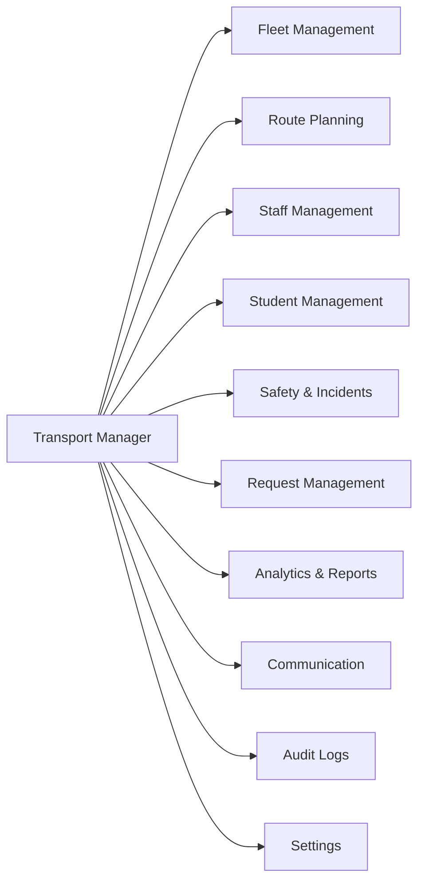
```mermaid
graph LR
    TM[Transport Manager] --> Fleet[Fleet Management]
    TM --> Routes[Route Planning]
    TM --> Staff[Staff Management]
    TM --> Students[Student Management]
    TM --> Safety[Safety & Incidents]
    TM --> Requests[Request Management]
    TM --> Reports[Analytics & Reports]
    TM --> Comm[Communication]
    TM --> Audit[Audit Logs]
    TM --> Settings[Settings]
```

</div>

**Key Features:**
- 🚌 **Fleet**: Vehicle inventory, maintenance, compliance
- 🗺️ **Routes**: Planning, monitoring, optimization
- 👥 **Staff**: Driver/assistant scheduling, assignments
- 👨‍🎓 **Students**: Assignments, attendance, change requests
- ⚠️ **Safety**: Incident reports, emergency management
- 📋 **Requests**: Route, student, fuel requests
- 📊 **Reports**: Operational, financial, compliance reports

#### 🚗 Driver
<div align="center">

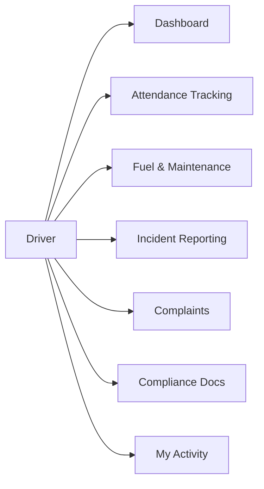
```mermaid
graph LR
    Driver[Driver] --> Dashboard[Dashboard]
    Driver --> Attendance[Attendance Tracking]
    Driver --> Fuel[Fuel & Maintenance]
    Driver --> Incidents[Incident Reporting]
    Driver --> Complaints[Complaints]
    Driver --> Compliance[Compliance Docs]
    Driver --> Activity[My Activity]
```

</div>

#### 🚐 Bus Assistant
<div align="center">

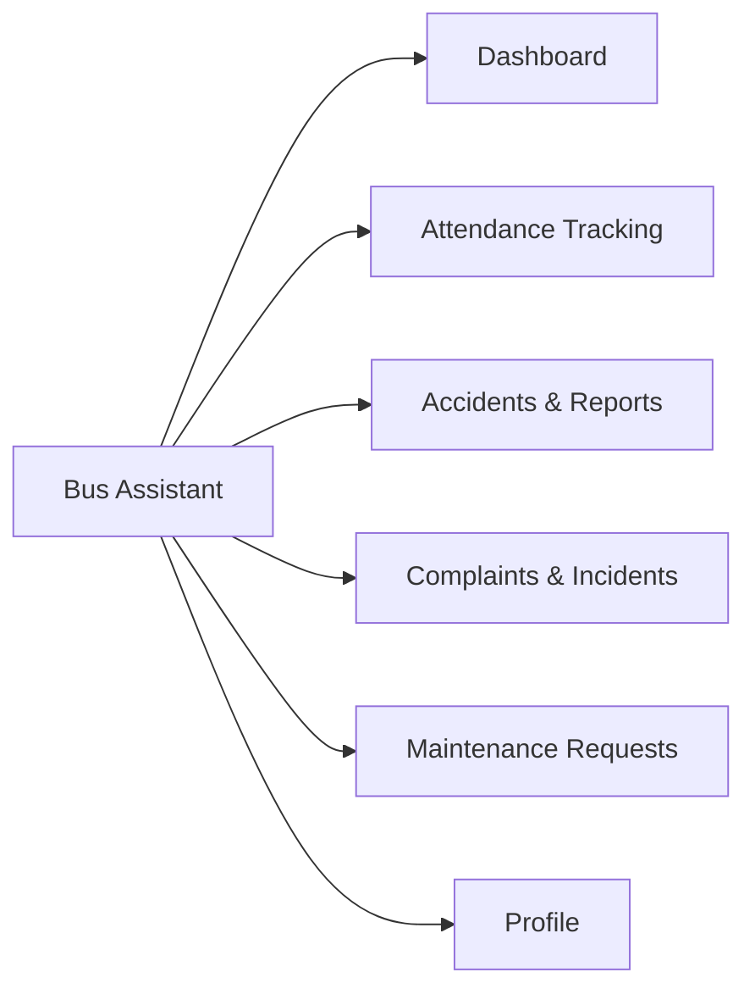
```mermaid
graph LR
    Assistant[Bus Assistant] --> Dashboard[Dashboard]
    Assistant --> Attendance[Attendance Tracking]
    Assistant --> Accidents[Accidents & Reports]
    Assistant --> Complaints[Complaints & Incidents]
    Assistant --> Maintenance[Maintenance Requests]
    Assistant --> Profile[Profile]
```

</div>

#### 👨‍👩 Parent
<div align="center">

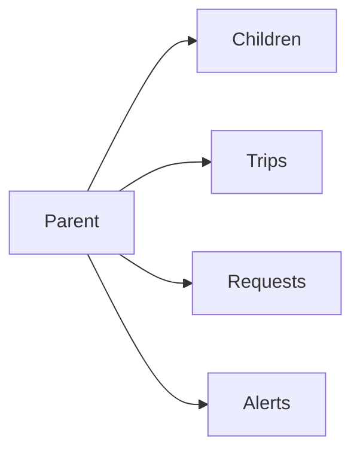
```mermaid
graph LR
    Parent[Parent] --> Children[Children]
    Parent --> Trips[Trips]
    Parent --> Requests[Requests]
    Parent --> Alerts[Alerts]
```

</div>

#### ⛽ Fuel Manager
<div align="center">

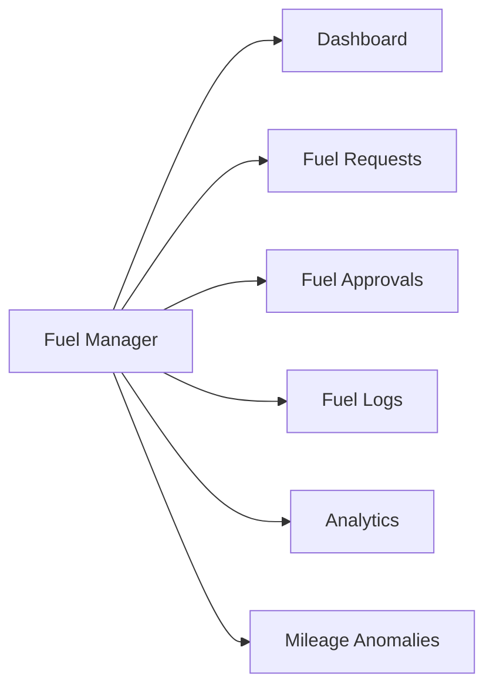
```mermaid
graph LR
    Fuel[Fuel Manager] --> Dashboard[Dashboard]
    Fuel --> Requests[Fuel Requests]
    Fuel --> Approvals[Fuel Approvals]
    Fuel --> Logs[Fuel Logs]
    Fuel --> Analytics[Analytics]
    Fuel --> Anomalies[Mileage Anomalies]
```

</div>

---

## ✨ Features

### 🎨 Dashboard Highlights

#### **🚀 Transport Manager Dashboard**
- **Real-time Metrics**: Live dashboard with actual database data
- **6 Key Metric Cards**: Operations, Fleet, Students, Staff, Routes, Requests
- **Quick Actions**: One-click navigation to key functions
- **Recent Activity**: Live feed of system events
- **Smart Navigation**: All cards and links are fully functional

#### **📱 Progressive Web App (PWA)**
- **Cross-Platform**: Works on iOS, Android, and desktop
- **Offline Support**: Cached content works without internet
- **Auto-Updates**: Service worker updates automatically
- **App-Like Experience**: Full-screen mode on mobile devices

#### **🗓️ Transport Calendar**
- **Academic Year Management**: Create and manage academic years
- **Term Scheduling**: Define academic terms with date ranges
- **Holiday Management**: Configure holidays and special events
- **Transport Availability**: Override default transport rules
- **Priority Events**: Make-up days, exam days, sports days

#### **🚐 Vehicle Route Assignments**
- **Period-Based Scheduling**: Morning, Evening, or Both
- **Flexible Assignments**: One vehicle, multiple routes
- **Date Ranges**: Seasonal assignment changes
- **Audit Trail**: Complete assignment history tracking
- **Academic Term Preset**: Quick assignment for entire academic terms via UI

#### **🚌 Automated Trip Generation**
- **Daily Scheduling**: Automatic generation of trips based on route assignments and transport calendar.
- **Calendar Integration**: Respects academic terms, holidays, and priority events (make-up, exam, sports days).
- **Manual Overrides**: On-demand execution (`generateTodayTrips.js`) for trip generation and debugging.

---

## 🚐 Vehicle-Route Assignments & Automation

### 📅 How Vehicle-Route Assignments Work

Vehicle-route assignments are designed to be set up **once** with date ranges, not recreated daily. The system automatically generates daily trips and attendance records based on these assignments.

### 🔄 Assignment Date Ranges

| Field | Purpose | Example |
|-------|---------|---------|
| `effective_from` | When the assignment starts | `2026-08-28` |
| `effective_to` | When the assignment ends (optional) | `2026-12-15` or `NULL` |
| `status` | Current state | `Active` |
| `time_period` | Trip sessions covered | `Morning`, `Evening`, or `Both` |

### 🎯 Setup Options

#### Option 1: Academic Term Coverage (Recommended)
```sql
-- Covers an entire academic term
INSERT INTO vehicle_route_assignments (
  vehicle_plate, route_id, time_period, status, 
  effective_from, effective_to, created_by_user_id
) VALUES (
  'KBN 876F', 6, 'Both', 'Active', 
  '2026-08-28', '2026-12-15', 4
);
```

#### Option 2: Indefinite Assignment
```sql
-- No end date - assignment continues until manually deactivated
INSERT INTO vehicle_route_assignments (
  vehicle_plate, route_id, time_period, status, 
  effective_from, created_by_user_id
) VALUES (
  'KBN 876F', 6, 'Both', 'Active', 
  '2026-08-28', 4
);
```

#### Option 3: Seasonal Changes
```sql
-- Different assignments for different seasons
-- Semester 1
INSERT INTO vehicle_route_assignments (...) VALUES (..., '2026-08-28', '2026-12-15', ...);

-- Semester 2 (created in advance)
INSERT INTO vehicle_route_assignments (...) VALUES (..., '2027-01-10', '2027-06-30', ...);
```

### 🤖 Automated Trip Generation Flow

<div align="center">

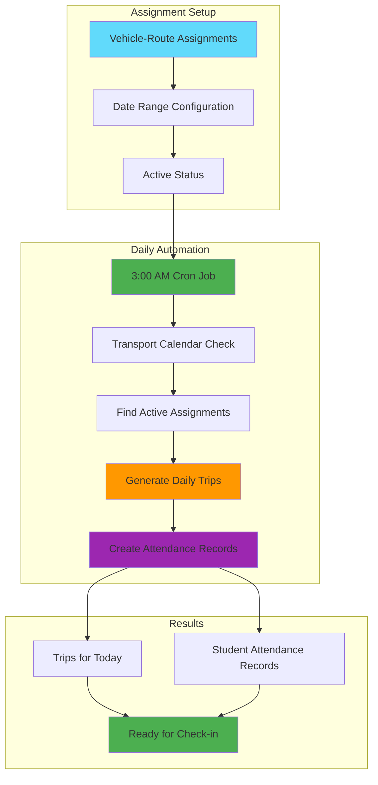
```mermaid
graph TB
    subgraph "Assignment Setup"
        Assign[Vehicle-Route Assignments]
        Date[Date Range Configuration]
        Status[Active Status]
    end
    
    subgraph "Daily Automation"
        Cron[3:00 AM Cron Job]
        Calendar[Transport Calendar Check]
        Active[Find Active Assignments]
        Trips[Generate Daily Trips]
        Attendance[Create Attendance Records]
    end
    
    subgraph "Results"
        TodayTrips[Trips for Today]
        StudentAttendance[Student Attendance Records]
        Ready[Ready for Check-in]
    end
    
    Assign --> Date
    Date --> Status
    Status --> Cron
    Cron --> Calendar
    Calendar --> Active
    Active --> Trips
    Trips --> Attendance
    Attendance --> TodayTrips
    Attendance --> StudentAttendance
    TodayTrips --> Ready
    StudentAttendance --> Ready
    
    style Assign fill:#61DAFB
    style Cron fill:#4CAF50
    style Trips fill:#FF9800
    style Attendance fill:#9C27B0
    style Ready fill:#4CAF50
```

</div>

### 📊 Assignment Criteria

The daily trips job automatically finds active assignments where:

```sql
effective_from <= today 
AND (effective_to IS NULL OR effective_to >= today) 
AND status = 'Active'
```

### 🔄 Daily Automation Process

Every day at **3:00 AM**, the system automatically:

1. **Checks transport availability** for the date via transport calendar
2. **Finds active vehicle-route assignments** matching today's date
3. **Generates trips** for each assignment (Morning and/or Evening sessions)
4. **Creates attendance records** for students assigned to those routes
5. **Handles holidays** automatically by skipping disabled transport days

### 🚐 Attendance Generation Sequence

<div align="center">

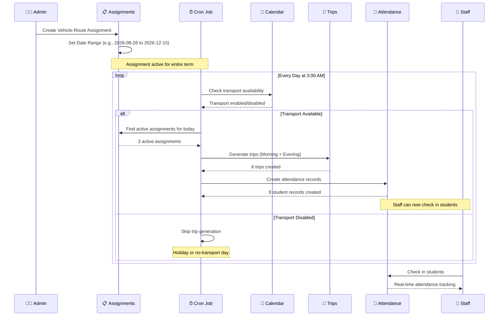
```mermaid
sequenceDiagram
    participant Admin as 👨‍💼 Admin
    participant Assign as 📋 Assignments
    participant Cron as ⏰ Cron Job
    participant Calendar as 📅 Calendar
    participant Trips as 🚐 Trips
    participant Attendance as 📝 Attendance
    participant Staff as 👥 Staff
    
    Admin->>Assign: Create Vehicle-Route Assignment
    Assign->>Assign: Set Date Range (e.g., 2026-08-28 to 2026-12-15)
    Note over Assign,Cron: Assignment active for entire term
    
    loop Every Day at 3:00 AM
        Cron->>Calendar: Check transport availability
        Calendar-->>Cron: Transport enabled/disabled
        alt Transport Available
            Cron->>Assign: Find active assignments for today
            Assign-->>Cron: 3 active assignments
            Cron->>Trips: Generate trips (Morning + Evening)
            Trips-->>Cron: 6 trips created
            Cron->>Attendance: Create attendance records
            Attendance-->>Cron: 9 student records created
            Note over Attendance,Staff: Staff can now check in students
        else Transport Disabled
            Cron->>Cron: Skip trip generation
            Note over Cron: Holiday or no-transport day
        end
    end
    
    Staff->>Attendance: Check in students
    Attendance-->>Staff: Real-time attendance tracking
```

</div>

### 🎨 UI Implementation

The system includes a comprehensive **Vehicle Assignments** interface with:

- **Academic Term Preset**: Quick assignment for entire academic terms
- **Manual Date Range**: Custom start and end dates
- **Real-time Preview**: See assignments for any date
- **Staff Assignment**: Link drivers and assistants to routes
- **Visual Management**: Card-based interface for easy management

### 🛠️ Manual Trip Generation

If you need to generate trips manually (e.g., after setting up assignments during the day):

```bash
cd backend
node scripts/generateTodayTrips.js
```

#### Using the Trip Generation API

The system provides REST API endpoints for manual trip generation and monitoring:

```bash
# Validate prerequisites before generation
curl -X GET "http://localhost:5000/api/trip-generation/validate?date=2026-08-28" \
  -H "Authorization: Bearer YOUR_TOKEN"

# Generate trips for a single date
curl -X POST http://localhost:5000/api/trip-generation/generate \
  -H "Authorization: Bearer YOUR_TOKEN" \
  -H "Content-Type: application/json" \
  -d '{"date": "2026-08-28"}'

# Generate trips for a date range
curl -X POST http://localhost:5000/api/trip-generation/generate-range \
  -H "Authorization: Bearer YOUR_TOKEN" \
  -H "Content-Type: application/json" \
  -d '{"startDate": "2026-08-28", "endDate": "2026-09-01"}'

# Force regeneration (bypass duplicate detection)
curl -X POST http://localhost:5000/api/trip-generation/generate \
  -H "Authorization: Bearer YOUR_TOKEN" \
  -H "Content-Type: application/json" \
  -d '{"date": "2026-08-28", "force": true}'
```

#### Live Progress Monitoring

Monitor trip generation and attendance in real-time:

```bash
# Get live trip progress for a date
curl -X GET "http://localhost:5000/api/trip-generation/progress?date=2026-08-28" \
  -H "Authorization: Bearer YOUR_TOKEN"

# Get dashboard metrics
curl -X GET "http://localhost:5000/api/trip-generation/dashboard-metrics?date=2026-08-28" \
  -H "Authorization: Bearer YOUR_TOKEN"

# Get detailed attendance for a specific trip
curl -X GET "http://localhost:5000/api/trip-generation/trips/17/attendance" \
  -H "Authorization: Bearer YOUR_TOKEN"
```

### 🔄 Assignment Management

#### Temporary Deactivation
```sql
-- Deactivate temporarily for maintenance
UPDATE vehicle_route_assignments 
SET status = 'Inactive' 
WHERE vehicle_plate = 'KBN 876F';

-- Reactivate when ready
UPDATE vehicle_route_assignments 
SET status = 'Active' 
WHERE vehicle_plate = 'KBN 876F';
```

#### Term Management
```sql
-- Create next term's assignments in advance
INSERT INTO vehicle_route_assignments (...) VALUES (..., '2027-01-10', '2027-06-30', ...);
```

### 📈 System Benefits

| Benefit | Description |
|---------|-------------|
| ⚡ **Automation** | No manual daily setup required |
| 📅 **Date Ranges** | One setup covers entire terms |
| 🎯 **Smart Scheduling** | Respects holidays and transport calendar |
| 🔄 **Automatic Attendance** | Students records created automatically |
| 🛡️ **Reliability** | Cron job ensures daily generation |
| 📊 **Audit Trail** | Complete history of assignments and changes |

### 🚨 Troubleshooting

#### Issue: No trips showing for today
**Solution:** Check that vehicle-route assignments exist and are active for today's date:
```sql
SELECT * FROM vehicle_route_assignments 
WHERE effective_from <= CURDATE() 
AND (effective_to IS NULL OR effective_to >= CURDATE()) 
AND status = 'Active';
```

#### Issue: No attendance records
**Solution:** Ensure:
1. Trips have been generated for today
2. Students are assigned to routes
3. Student-route assignments are active
4. Transport is available for today

#### Issue: Holidays not respected
**Solution:** Configure holiday events in the transport calendar:
```sql
INSERT INTO calendar_events (date, title, event_type, transport_available) 
VALUES ('2026-12-25', 'Christmas Day', 'Holiday', false);
```

---

## 🤖 Trip Generation Service

The **Trip Generation Service** is a centralized, idempotent system for generating daily trips and attendance records. It ensures consistent behavior across cron jobs, manual scripts, and API calls.

### 🎯 Core Principles

| Principle | Description |
|-----------|-------------|
| **Idempotent** | Safe to run multiple times without creating duplicates |
| **Centralized** | Single service used by cron, CLI, and API |
| **Auditable** | Tracks generation source, timestamp, and user |
| **Validated** | Prerequisites checked before generation |
| **Transactional** | Atomic trip and attendance creation |

### 📊 Service Architecture

<div align="center">

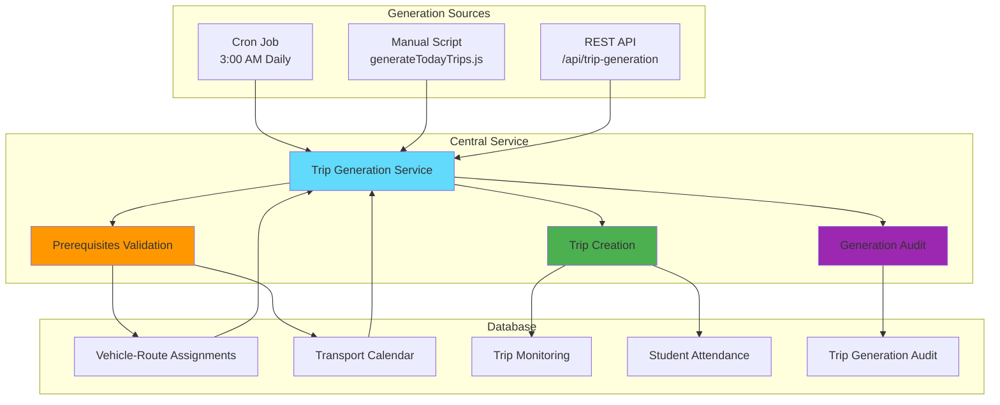
```mermaid
graph TB
    subgraph "Generation Sources"
        Cron[Cron Job<br/>3:00 AM Daily]
        CLI[Manual Script<br/>generateTodayTrips.js]
        API[REST API<br/>/api/trip-generation]
    end
    
    subgraph "Central Service"
        Service[Trip Generation Service]
        Validate[Prerequisites Validation]
        Generate[Trip Creation]
        Audit[Generation Audit]
    end
    
    subgraph "Database"
        Assign[Vehicle-Route Assignments]
        Calendar[Transport Calendar]
        Trips[Trip Monitoring]
        Attendance[Student Attendance]
        AuditLog[Trip Generation Audit]
    end
    
    Cron --> Service
    CLI --> Service
    API --> Service
    
    Service --> Validate
    Validate --> Calendar
    Validate --> Assign
    Calendar --> Service
    Assign --> Service
    
    Service --> Generate
    Generate --> Trips
    Generate --> Attendance
    
    Service --> Audit
    Audit --> AuditLog
    
    style Service fill:#61DAFB
    style Validate fill:#FF9800
    style Generate fill:#4CAF50
    style Audit fill:#9C27B0
```

</div>

### 🔍 Prerequisites Validation

Before generating trips, the service validates:

1. **Transport Availability**: Checks if transport is enabled for the target date
2. **Active Assignments**: Confirms vehicle-route assignments exist for the date
3. **Student Assignments**: Verifies students are assigned to routes
4. **Route Status**: Ensures routes are active
5. **Vehicle Availability**: Confirms vehicles are operational

```javascript
{
  "valid": true,
  "reason": "All prerequisites met",
  "checks": {
    "transportAvailable": true,
    "assignmentsExist": true,
    "studentsAssigned": true,
    "routesActive": true,
    "vehiclesAvailable": true
  }
}
```

### 🚀 Generation Process

<div align="center">

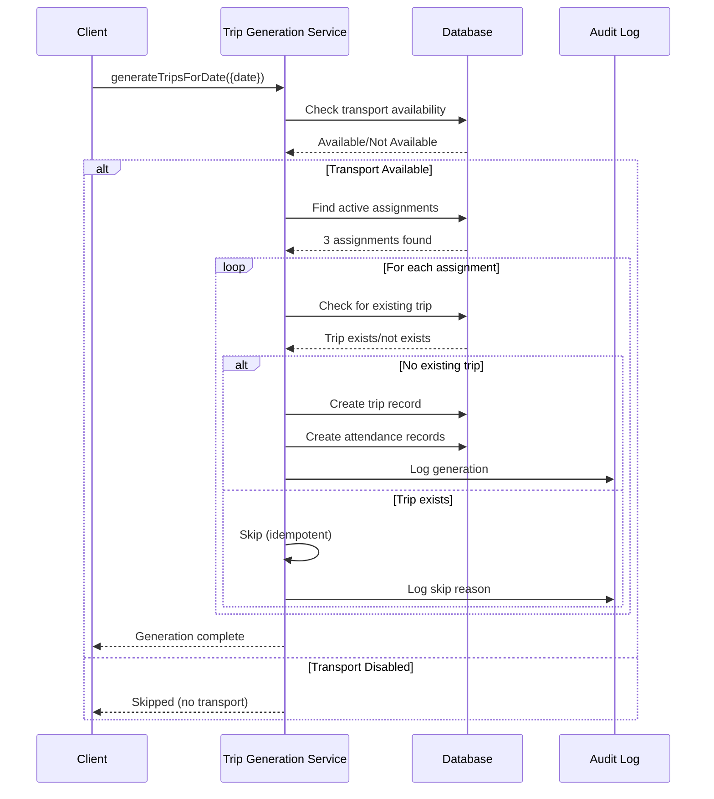
```mermaid
sequenceDiagram
    participant Client as Client
    participant Service as Trip Generation Service
    participant DB as Database
    participant Audit as Audit Log
    
    Client->>Service: generateTripsForDate({date})
    Service->>DB: Check transport availability
    DB-->>Service: Available/Not Available
    
    alt Transport Available
        Service->>DB: Find active assignments
        DB-->>Service: 3 assignments found
        
        loop For each assignment
            Service->>DB: Check for existing trip
            DB-->>Service: Trip exists/not exists
            
            alt No existing trip
                Service->>DB: Create trip record
                Service->>DB: Create attendance records
                Service->>Audit: Log generation
            else Trip exists
                Service->>Service: Skip (idempotent)
                Service->>Audit: Log skip reason
            end
        end
        
        Service-->>Client: Generation complete
    else Transport Disabled
        Service-->>Client: Skipped (no transport)
    end
```

</div>

### 📝 Generation Output

The service returns detailed statistics:

```json
{
  "date": "2026-09-01",
  "transportEnabled": true,
  "assignmentsProcessed": 3,
  "tripsCreated": 6,
  "tripsSkipped": 0,
  "attendanceCreated": 9,
  "duplicatePreventions": []
}
```

For idempotent runs (when trips already exist):

```json
{
  "date": "2026-09-01",
  "transportEnabled": true,
  "assignmentsProcessed": 3,
  "tripsCreated": 0,
  "tripsSkipped": 6,
  "attendanceCreated": 0,
  "duplicatePreventions": [
    {
      "routeId": 6,
      "routeName": "Magenche",
      "period": "Morning",
      "reason": "existing_trip",
      "existingTripId": 23
    }
  ]
}
```

### 🧪 Testing the Service

Run the comprehensive test suite:

```bash
cd backend
node scripts/testTripGeneration.js
```

This validates:
- ✅ Prerequisites validation
- ✅ Trip generation
- ✅ Idempotency (no duplicates)
- ✅ Force regeneration
- ✅ Attendance creation

### 📡 API Endpoints

| Endpoint | Method | Description | Auth |
|----------|--------|-------------|------|
| `/api/trip-generation/validate` | GET | Validate prerequisites | TM, SA |
| `/api/trip-generation/generate` | POST | Generate trips for a date | TM, SA |
| `/api/trip-generation/generate-range` | POST | Generate trips for date range | TM, SA |
| `/api/trip-generation/progress` | GET | Get live trip progress | TM, SA |
| `/api/trip-generation/trips/:tripId/attendance` | GET | Get trip attendance details | TM, SA |
| `/api/trip-generation/dashboard-metrics` | GET | Get dashboard metrics | TM, SA |

**Note:** TM = Transport Manager, SA = School Admin

### 🔒 Database Audit Trail

The service maintains an audit trail in `trip_generation_audit`:

```sql
CREATE TABLE trip_generation_audit (
  id INT AUTO_INCREMENT PRIMARY KEY,
  generation_date DATE NOT NULL,
  source ENUM('cron', 'api', 'cli') NOT NULL,
  user_id INT,
  trips_generated INT DEFAULT 0,
  trips_skipped INT DEFAULT 0,
  attendance_created INT DEFAULT 0,
  error_message TEXT,
  generated_at TIMESTAMP DEFAULT CURRENT_TIMESTAMP
);
```

### 🛠️ Service Files

| File | Purpose |
|------|---------|
| `backend/src/services/tripGenerationService.js` | Core generation logic |
| `backend/src/services/tripStatusService.js` | Live progress tracking |
| `backend/src/controllers/tripGeneration.controller.js` | API request handlers |
| `backend/src/routes/tripGeneration.routes.js` | API route definitions |
| `backend/src/jobs/dailyTrips.job.js` | Cron job integration |
| `backend/scripts/generateTodayTrips.js` | Manual CLI script |
| `backend/scripts/testTripGeneration.js` | Test suite |

### 🎨 Live Progress Tracking

The `tripStatusService` provides real-time monitoring:

```javascript
{
  "date": "2026-09-01",
  "summary": {
    "totalTrips": 6,
    "totalStudents": 9,
    "totalBoarded": 5,
    "totalDroppedOff": 3,
    "totalRemaining": 4,
    "activeTrips": 2,
    "completedTrips": 1,
    "overallProgress": 56
  },
  "trips": [
    {
      "tripId": 23,
      "routeName": "Magenche",
      "vehiclePlate": "KBN 876F",
      "status": "On Time",
      "session": "Morning",
      "progress": {
        "totalStudents": 3,
        "boarded": 2,
        "absent": 1,
        "percentage": 67
      }
    }
  ]
}
```

---

<div align="center">

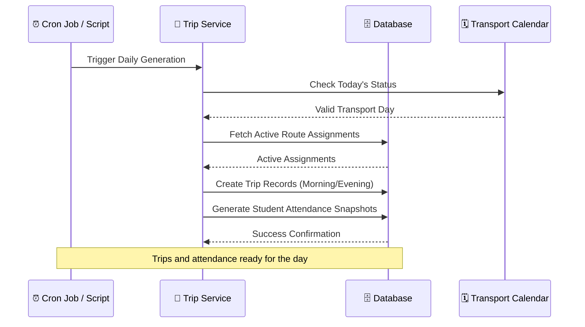
```mermaid
sequenceDiagram
    participant Cron as ⏰ Cron Job / Script
    participant API as 🔌 Trip Service
    participant DB as 🗄️ Database
    participant Calendar as 🗓️ Transport Calendar
    
    Cron->>API: Trigger Daily Generation
    API->>Calendar: Check Today's Status
    Calendar-->>API: Valid Transport Day
    API->>DB: Fetch Active Route Assignments
    DB-->>API: Active Assignments
    API->>DB: Create Trip Records (Morning/Evening)
    API->>DB: Generate Student Attendance Snapshots
    DB-->>API: Success Confirmation
    Note over Cron,DB: Trips and attendance ready for the day
```

</div>

---

## 📁 Project Structure

```
Soho/
├── 📂 backend/                          # Express REST API
│   ├── 📄 package.json
│   ├── 🚀 server.js                      # Entry point
│   ├── ⚙️ .env                          # Environment variables
│   ├── 📁 logs/                         # Application logs
│   └── 📁 src/
│       ├── 📄 app.js                    # Express configuration
│       ├── 📁 config/                   # Configuration files
│       ├── 📁 controllers/              # Request handlers
│       ├── 📁 middlewares/              # Express middleware
│       ├── 📁 migration/                # Database schemas
│       ├── 📁 routes/                   # API routes
│       ├── 📁 services/                 # Business logic
│       ├── 📁 jobs/                     # Scheduled tasks
│       └── 📁 validators/                # Request validation
│
├── 📂 frontend/                         # React TypeScript SPA
│   ├── 📄 package.json
│   ├── ⚙️ vite.config.ts              # Vite configuration
│   ├── 📄 index.html
│   └── 📁 src/
│       ├── 📄 main.tsx                  # React entry point
│       ├── 📄 App.tsx                   # Router configuration
│       ├── 📁 contexts/                 # React Context providers
│       ├── 📁 lib/                      # Shared utilities
│       ├── 📁 components/               # React components
│       │   ├── 📁 Auth/                 # Authentication
│       │   ├── 📁 Dashboard/            # Dashboards
│       │   ├── 📁 Common/               # Shared UI
│       │   └── 📁 Performance/          # Optimization
│       ├── 📁 assets/                   # Static assets
│       └── 📁 styles/                   # Global styles
│
├── 📂 deploy/                           # Deployment configs
│   ├── 📁 docker/                       # Docker configurations
│   ├── 📁 nginx/                        # Nginx configuration
│   └── 📁 pm2/                          # Process manager
│
└── 📂 docs/                             # Documentation
    ├── 📁 architecture/                 # Architecture docs
    ├── 📁 deployment/                   # Deployment guides
    └── 📁 postman/                      # API collections
```

---

## 🏗️ Architecture

### System Architecture Diagram

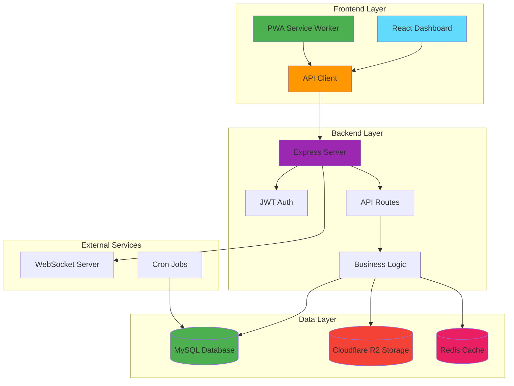
```mermaid
graph TB
    subgraph "Frontend Layer"
        UI[React Dashboard]
        PWA[PWA Service Worker]
        API[API Client]
    end
    
    subgraph "Backend Layer"
        Server[Express Server]
        Auth[JWT Auth]
        Routes[API Routes]
        Services[Business Logic]
    end
    
    subgraph "Data Layer"
        MySQL[(MySQL Database)]
        R2[(Cloudflare R2 Storage)]
        Redis[(Redis Cache)]
    end
    
    subgraph "External Services"
        WS[WebSocket Server]
        Cron[Cron Jobs]
    end
    
    UI --> API
    PWA --> API
    API --> Server
    Server --> Auth
    Server --> Routes
    Routes --> Services
    Services --> MySQL
    Services --> R2
    Services --> Redis
    Server --> WS
    Cron --> MySQL
    
    style UI fill:#61DAFB
    style PWA fill:#4CAF50
    style API fill:#FF9800
    style Server fill:#9C27B0
    style MySQL fill:#4CAF50
    style R2 fill:#F44336
    style Redis fill:#E91E63
```

### Data Flow Diagram

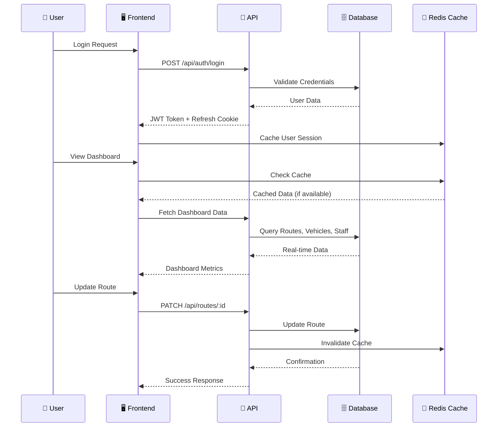
```mermaid
sequenceDiagram
    participant User as 👤 User
    participant UI as 🖥️ Frontend
    participant API as 🔌 API
    participant DB as 🗄️ Database
    participant Cache as 💾 Redis Cache
    
    User->>UI: Login Request
    UI->>API: POST /api/auth/login
    API->>DB: Validate Credentials
    DB-->>API: User Data
    API-->>UI: JWT Token + Refresh Cookie
    UI->>Cache: Cache User Session
    
    User->>UI: View Dashboard
    UI->>Cache: Check Cache
    Cache-->>UI: Cached Data (if available)
    UI->>API: Fetch Dashboard Data
    API->>DB: Query Routes, Vehicles, Staff
    DB-->>API: Real-time Data
    API-->>UI: Dashboard Metrics
    
    User->>UI: Update Route
    UI->>API: PATCH /api/routes/:id
    API->>DB: Update Route
    API->>Cache: Invalidate Cache
    DB-->>API: Confirmation
    API-->>UI: Success Response
```

### Component Architecture

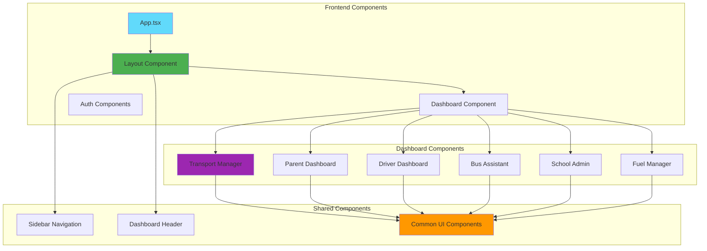
```mermaid
graph TB
    subgraph "Frontend Components"
        App[App.tsx]
        Layout[Layout Component]
        Dashboard[Dashboard Component]
        Auth[Auth Components]
    end
    
    subgraph "Dashboard Components"
        TM[Transport Manager]
        Parent[Parent Dashboard]
        Driver[Driver Dashboard]
        Assistant[Bus Assistant]
        Admin[School Admin]
        Fuel[Fuel Manager]
    end
    
    subgraph "Shared Components"
        Sidebar[Sidebar Navigation]
        Header[Dashboard Header]
        Common[Common UI Components]
    end
    
    App --> Layout
    Layout --> Sidebar
    Layout --> Header
    Layout --> Dashboard
    Dashboard --> TM
    Dashboard --> Parent
    Dashboard --> Driver
    Dashboard --> Assistant
    Dashboard --> Admin
    Dashboard --> Fuel
    TM --> Common
    Parent --> Common
    Driver --> Common
    Assistant --> Common
    Admin --> Common
    Fuel --> Common
    
    style App fill:#61DAFB
    style Layout fill:#4CAF50
    style TM fill:#9C27B0
    style Common fill:#FF9800
```

---

## 📊 Database Schema

### Entity Relationship Diagram

```mermaid
erDiagram
    USERS ||--o{ NUMBER_PLATES : "has"
    USERS ||--o{ INCIDENT_REPORTS : "reports"
    USERS ||--o{ COMPLAINT_REPORTS : "submits"
    USERS ||--o{ FUEL_MAINTENANCE_REQUESTS : "requests"
    USERS ||--o{ STUDENT_ROUTE_ASSIGNMENT : "manages"
    
    NUMBER_PLATES ||--o{ VEHICLE_ROUTE_ASSIGNMENTS : "assigned_to"
    ROUTES ||--o{ VEHICLE_ROUTE_ASSIGNMENTS : "assigned_to"
    ROUTES ||--o{ ROUTE_STOPS : "contains"
    ROUTES ||--o{ STUDENT_ROUTE_ASSIGNMENT : "for"
    
    STUDENTS ||--o{ STUDENT_ROUTE_ASSIGNMENT : "assigned_to"
    STUDENTS ||--o{ STUDENT_PARENT_CONTACT_CHANGES : "has"
    
    ACADEMIC_YEARS ||--o{ ACADEMIC_TERMS : "contains"
    ACADEMIC_YEARS ||--o{ CALENDAR_EVENTS : "has"
    
    TRIP_MONITORING ||--o{ TRIP_STOPS : "progresses_through"
    TRIP_MONITORING ||--o{ ATTENDANCE_RECORDS : "tracks"
    
    USERS {
        id INT PK
        email VARCHAR UNIQUE
        password_hash VARCHAR
        role ENUM
        first_name VARCHAR
        last_name VARCHAR
        created_at TIMESTAMP
    }
    
    NUMBER_PLATES {
        plate_number VARCHAR PK
        status ENUM
        created_at TIMESTAMP
    }
    
    ROUTES {
        id INT PK
        route_code VARCHAR UNIQUE
        route_name VARCHAR
        status ENUM
        created_at TIMESTAMP
    }
    
    VEHICLE_ROUTE_ASSIGNMENTS {
        id INT PK
        vehicle_plate VARCHAR FK
        route_id INT FK
        time_period ENUM
        status ENUM
        effective_from DATE
    }
    
    STUDENTS {
        id INT PK
        admission_number VARCHAR UNIQUE
        first_name VARCHAR
        last_name VARCHAR
        grade VARCHAR
        stream VARCHAR
    }
```

### Key Tables

| Table | Purpose | Key Fields |
|-------|---------|------------|
| `users` | User accounts | id, email, role, password_hash |
| `number_plates` | Vehicle registration | plate_number, status |
| `routes` | Route definitions | id, route_code, route_name, status |
| `route_stops` | Route stops | id, routeId, stopType, locationName |
| `vehicle_route_assignments` | Vehicle-route assignments | vehicle_plate, route_id, time_period |
| `students` | Student records | id, admission_number, grade, stream |
| `fuel_maintenance_requests` | Fuel/maintenance requests | id, requestType, status, amount |
| `incident_reports` | Incident documentation | id, incidentDate, description, status |
| `academic_years` | Academic year definitions | id, name, startDate, endDate |
| `calendar_events` | Calendar events | id, date, title, eventType, transportAvailable |

---

## 🚢 API Documentation

### API Endpoints Overview

<div align="center">

```mermaid
graph TB
    API[API Endpoints] --> Auth[/api/auth]
    API --> Transport[/api/transport-manager]
    API --> Parent[/api/parent]
    API --> Fuel[/api/fuel-maintenance]
    API --> Incidents[/api/incidents]
    API --> Complaints[/api/complaints]
    API --> Compliance[/api/compliance-documents]
    
    Auth --> Login[POST /login]
    Auth --> Register[POST /register]
    Auth --> Logout[POST /logout]
    Auth --> Me[GET /me]
    
    Transport --> Routes[GET /routes]
    Transport --> Vehicles[GET /vehicles]
    Transport --> Staff[GET /staff]
    Transport --> Students[GET /students]
    Transport --> Trips[GET /trips]
    Transport --> Requests[GET /parent-requests]
    
    Parent --> Children[GET /children]
    Parent --> Transport[GET /children/transport]
    Parent --> Requests[GET /transport-requests]
    
    Fuel --> Requests[GET /requests]
    Fuel --> Approvals[PATCH /requests/:id/status]
    
    Incidents --> Reports[GET /reports]
    Incidents --> AllReports[GET /all/reports]
    Incidents --> Status[PATCH /reports/:id/status]
    
    style API fill:#61DAFB
    style Auth fill:#4CAF50
    style Transport fill:#9C27B0
    style Parent fill:#FF9800
    style Fuel fill:#F44336
```

</div>

### Authentication Endpoints

| Method | Endpoint | Description | Auth Required |
|--------|----------|-------------|----------------|
| POST | `/api/auth/register` | Register new user | No |
| POST | `/api/auth/login` | Login user | No |
| POST | `/api/auth/logout` | Logout user | Yes |
| GET | `/api/auth/me` | Get current user | Yes |

### Transport Manager Endpoints

| Method | Endpoint | Description | Auth Required |
|--------|----------|-------------|----------------|
| GET | `/api/transport-manager/routes` | Get all routes | Transport Manager, School Admin |
| POST | `/api/transport-manager/routes` | Create new route | Transport Manager, School Admin |
| GET | `/api/transport-manager/vehicles` | Get all vehicles | Transport Manager, School Admin |
| GET | `/api/transport-manager/staff` | Get all staff | Transport Manager, School Admin |
| GET | `/api/transport-manager/students` | Get all students | Transport Manager, School Admin |
| GET | `/api/transport-manager/trips` | Get all trips | Transport Manager, School Admin |
| GET | `/api/transport-manager/parent-requests` | Get parent requests | Transport Manager, School Admin |

### Fuel Management Endpoints

| Method | Endpoint | Description | Auth Required |
|--------|----------|-------------|----------------|
| GET | `/api/fuel-maintenance/requests` | Get all requests | Driver, Assistant, TM, FM, SA |
| POST | `/api/fuel-maintenance/requests` | Create request | Driver, Assistant, FM |
| PATCH | `/api/fuel-maintenance/requests/:id/status` | Update status | TM, FM, SA |

---

## 🔐 Security

### Authentication Flow

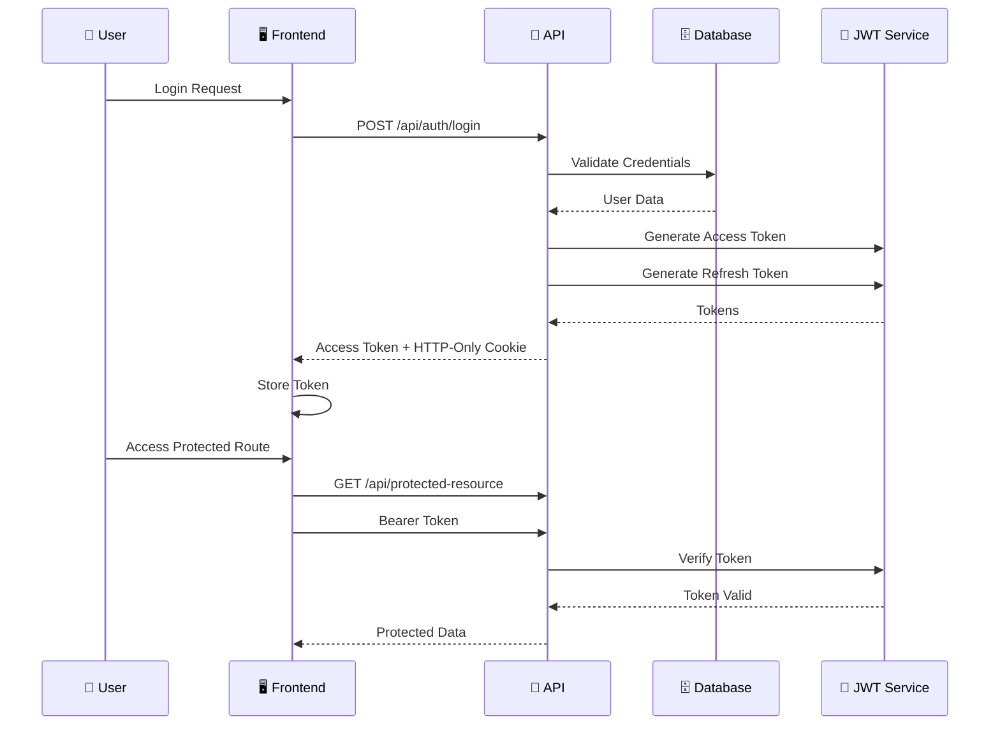
```mermaid
sequenceDiagram
    participant User as 👤 User
    participant Frontend as 🖥️ Frontend
    participant API as 🔌 API
    participant DB as 🗄️ Database
    participant JWT as 🔐 JWT Service
    
    User->>Frontend: Login Request
    Frontend->>API: POST /api/auth/login
    API->>DB: Validate Credentials
    DB-->>API: User Data
    API->>JWT: Generate Access Token
    API->>JWT: Generate Refresh Token
    JWT-->>API: Tokens
    API-->>Frontend: Access Token + HTTP-Only Cookie
    Frontend->>Frontend: Store Token
    
    User->>Frontend: Access Protected Route
    Frontend->>API: GET /api/protected-resource
    Frontend->>API: Bearer Token
    API->>JWT: Verify Token
    JWT-->>API: Token Valid
    API-->>Frontend: Protected Data
```

### Security Features

- 🔐 **JWT Authentication**: Secure token-based authentication
- 🍪 **HTTP-Only Cookies**: Refresh tokens stored securely
- 🛡️ **Role-Based Access Control**: Granular permissions per role
- 🔒 **Input Validation**: Request sanitization and validation
- 🚫 **SQL Injection Prevention**: Parameterized queries
- 🌐 **CORS Configuration**: Cross-origin resource sharing
- 📜 **Security Headers**: Helmet middleware for HTTP security
- 📝 **Audit Logging**: Complete audit trail of system changes

---

## 🧪 Testing

### Test Coverage

<div align="center">

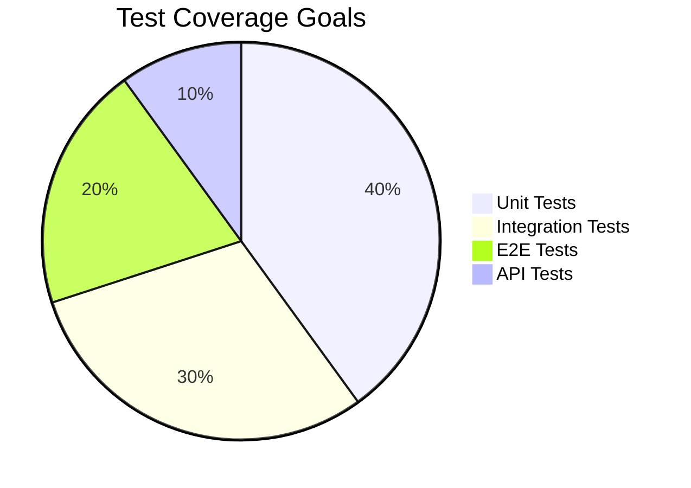
```mermaid
pie title Test Coverage Goals
    "Unit Tests" : 40
    "Integration Tests" : 30
    "E2E Tests" : 20
    "API Tests" : 10
```

</div>

### Running Tests

```bash
# Backend tests
cd backend
npm test

# Frontend tests
cd frontend
npm test

# E2E tests
npm run test:e2e
```

---

## 📦 Deployment

### Deployment Architecture

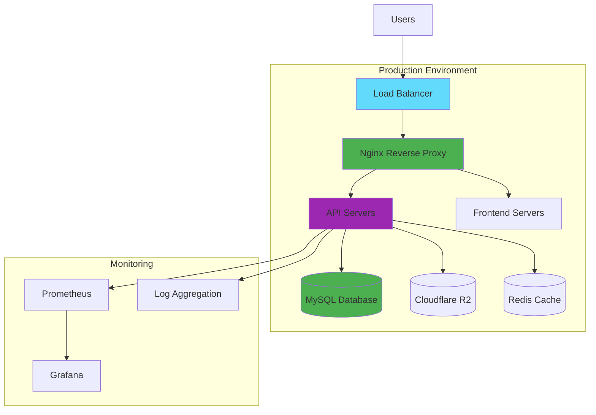
```mermaid
graph TB
    subgraph "Production Environment"
        LB[Load Balancer]
        Nginx[Nginx Reverse Proxy]
        API[API Servers]
        FE[Frontend Servers]
        DB[(MySQL Database)]
        R2[(Cloudflare R2)]
        Redis[(Redis Cache)]
    end
    
    subgraph "Monitoring"
        Prometheus[Prometheus]
        Grafana[Grafana]
        Logs[Log Aggregation]
    end
    
    User[Users] --> LB
    LB --> Nginx
    Nginx --> API
    Nginx --> FE
    API --> DB
    API --> R2
    API --> Redis
    API --> Prometheus
    Prometheus --> Grafana
    API --> Logs
    
    style LB fill:#61DAFB
    style Nginx fill:#4CAF50
    style API fill:#9C27B0
    style DB fill:#4CAF50
```

### Deployment Steps

#### 1. Docker Deployment

```bash
# Build and start containers
docker-compose up -d

# View logs
docker-compose logs -f

# Stop containers
docker-compose down
```

#### 2. Manual Deployment

```bash
# Backend
cd backend
npm run build
pm2 start server.js --name soho-backend

# Frontend
cd frontend
npm run build
pm2 start "serve -s dist -l 3000" --name soho-frontend
```

#### 3. Environment Configuration

**Production .env Example:**
```env
NODE_ENV=production
PORT=5000
DB_HOST=production-db-host
DB_USER=production-user
DB_PASSWORD=secure-password
DB_NAME=Soho_Academy
JWT_SECRET=strong-production-secret
FRONTEND_ORIGIN=https://your-domain.com
R2_ACCOUNT_ID=your-account-id
R2_ACCESS_KEY_ID=your-access-key
R2_SECRET_ACCESS_KEY=your-secret-key
R2_BUCKET_NAME=your-bucket
```

---

## 🤝 Contributing

### Contribution Guidelines

1. **Fork the repository**
2. **Create a feature branch** (`git checkout -b feature/amazing-feature`)
3. **Commit your changes** (`git commit -m 'Add amazing feature'`)
4. **Push to the branch** (`git push origin feature/amazing-feature`)
5. **Open a Pull Request**

### Code Style

- Follow existing code patterns
- Use TypeScript for all new components
- Add proper type definitions
- Write meaningful commit messages
- Add comments for complex logic

---

## 📄 License

This project is licensed under the MIT License - see the LICENSE file for details.

---

<div align="center">

**Made with ❤️ by the Soho Team**

[⭐ Star us on GitHub](https://github.com/DeCLAN-designs/Soho_Academy)
[🐛 Report Issues](https://github.com/DeCLAN-designs/Soho_Academy/issues)
[📖 Documentation](https://github.com/DeCLAN-designs/Soho_Academy/wiki)

</div>
