# 🚌 Soho Transport Management System

<div align="center">


*A comprehensive role-based school transport management platform for coordinating vehicles, routes, drivers, bus assistants, students, parents, requests, incidents, compliance documents, and transport operations.*

[](https://your-demo-url.com)
[](https://your-docs-url.com)

</div>

---

## 📋 Table of Contents

- [🌟 Overview](#-overview)
- [✨ Features](#-features)
- [🏗️ Architecture](#️-architecture)
- [🚀 Quick Start](#-quick-start)
- [📁 Project Structure](#-project-structure)
- [👥 User Roles](#-user-roles)
- [🔧 Tech Stack](#-tech-stack)
- [🔐 Security](#-security)
- [📊 Database Schema](#-database-schema)
- [🚢 API Documentation](#-api-documentation)
- [🧪 Testing](#-testing)
- [📦 Deployment](#-deployment)
- [🤝 Contributing](#-contributing)
- [📄 License](#-license)

---

## 🌟 Overview

Soho is a **complete school transport management solution** that streamlines the coordination of vehicles, routes, drivers, students, and parents. The system provides real-time tracking, automated scheduling, incident management, and comprehensive reporting.

### 🎯 Key Capabilities

| Feature | Description |
|---------|-------------|
| 🚌 **Fleet Management** | Vehicle inventory, maintenance scheduling, compliance tracking |
| 🗺️ **Route Planning** | Intelligent route optimization, stop management, GPS tracking |
| 👨‍👩 **Student Safety** | Real-time attendance tracking, parent notifications, emergency alerts |
| 👥 **Staff Management** | Driver scheduling, assistant assignments, performance tracking |
| ⛽ **Fuel Management** | Fuel consumption monitoring, cost analysis, mileage tracking |
| 📊 **Analytics** | Comprehensive reporting, operational insights, trend analysis |
| 🔔 **Communication** | Automated notifications, announcements, messaging system |

---

## ✨ Features

### 🎨 Dashboard Highlights

#### **🚀 Transport Manager Dashboard**
- **Real-time Metrics**: Live dashboard with actual database data
- **6 Key Metric Cards**: Operations, Fleet, Students, Staff, Routes, Requests
- **Quick Actions**: One-click navigation to key functions
- **Recent Activity**: Live feed of system events
- **Smart Navigation**: All cards and links are fully functional

#### **📱 Progressive Web App (PWA)**
- **Cross-Platform**: Works on iOS, Android, and desktop
- **Offline Support**: Cached content works without internet
- **Auto-Updates**: Service worker updates automatically
- **App-Like Experience**: Full-screen mode on mobile devices

#### **🗓️ Transport Calendar**
- **Academic Year Management**: Create and manage academic years
- **Term Scheduling**: Define academic terms with date ranges
- **Holiday Management**: Configure holidays and special events
- **Transport Availability**: Override default transport rules
- **Priority Events**: Make-up days, exam days, sports days

#### **🚐 Vehicle Route Assignments**
- **Period-Based Scheduling**: Morning, Evening, or Both
- **Flexible Assignments**: One vehicle, multiple routes
- **Date Ranges**: Seasonal assignment changes
- **Audit Trail**: Complete assignment history tracking

---

## 🏗️ Architecture

### System Architecture Diagram

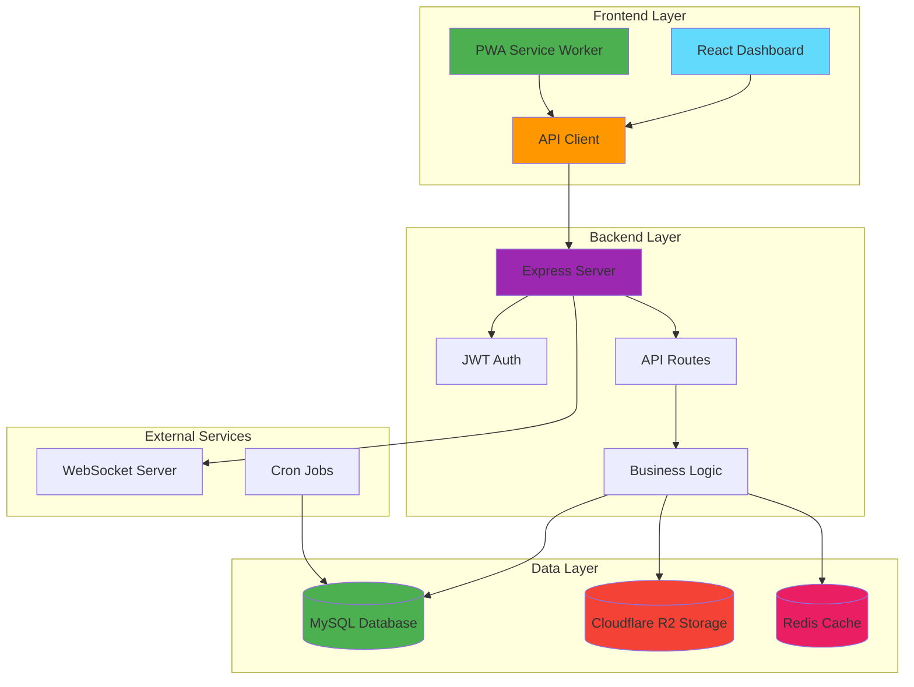
```mermaid
graph TB
    subgraph "Frontend Layer"
        UI[React Dashboard]
        PWA[PWA Service Worker]
        API[API Client]
    end
    
    subgraph "Backend Layer"
        Server[Express Server]
        Auth[JWT Auth]
        Routes[API Routes]
        Services[Business Logic]
    end
    
    subgraph "Data Layer"
        MySQL[(MySQL Database)]
        R2[(Cloudflare R2 Storage)]
        Redis[(Redis Cache)]
    end
    
    subgraph "External Services"
        WS[WebSocket Server]
        Cron[Cron Jobs]
    end
    
    UI --> API
    PWA --> API
    API --> Server
    Server --> Auth
    Server --> Routes
    Routes --> Services
    Services --> MySQL
    Services --> R2
    Services --> Redis
    Server --> WS
    Cron --> MySQL
    
    style UI fill:#61DAFB
    style PWA fill:#4CAF50
    style API fill:#FF9800
    style Server fill:#9C27B0
    style MySQL fill:#4CAF50
    style R2 fill:#F44336
    style Redis fill:#E91E63
```

### Data Flow Diagram

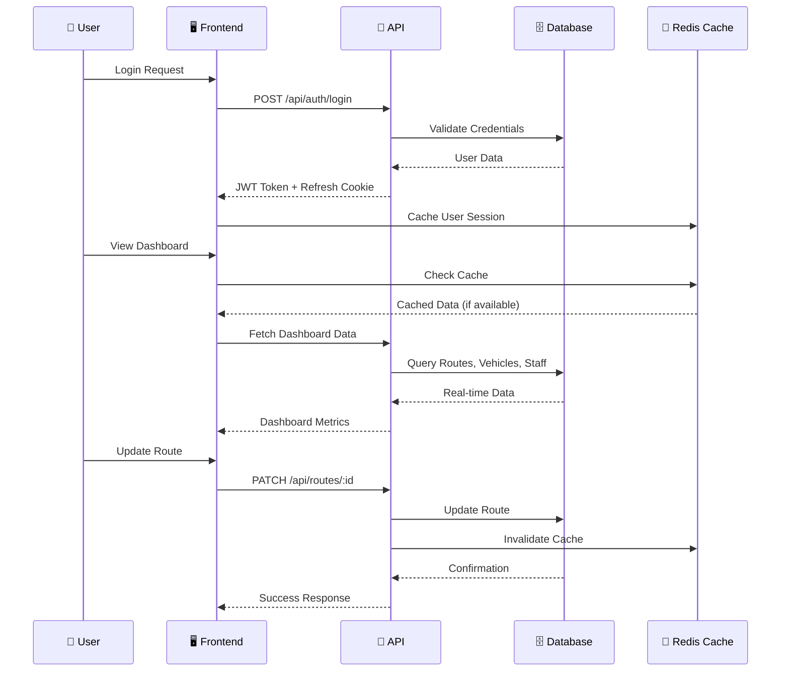
```mermaid
sequenceDiagram
    participant User as 👤 User
    participant UI as 🖥️ Frontend
    participant API as 🔌 API
    participant DB as 🗄️ Database
    participant Cache as 💾 Redis Cache
    
    User->>UI: Login Request
    UI->>API: POST /api/auth/login
    API->>DB: Validate Credentials
    DB-->>API: User Data
    API-->>UI: JWT Token + Refresh Cookie
    UI->>Cache: Cache User Session
    
    User->>UI: View Dashboard
    UI->>Cache: Check Cache
    Cache-->>UI: Cached Data (if available)
    UI->>API: Fetch Dashboard Data
    API->>DB: Query Routes, Vehicles, Staff
    DB-->>API: Real-time Data
    API-->>UI: Dashboard Metrics
    
    User->>UI: Update Route
    UI->>API: PATCH /api/routes/:id
    API->>DB: Update Route
    API->>Cache: Invalidate Cache
    DB-->>API: Confirmation
    API-->>UI: Success Response
```

### Component Architecture

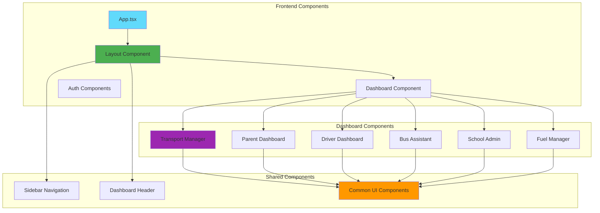
```mermaid
graph TB
    subgraph "Frontend Components"
        App[App.tsx]
        Layout[Layout Component]
        Dashboard[Dashboard Component]
        Auth[Auth Components]
    end
    
    subgraph "Dashboard Components"
        TM[Transport Manager]
        Parent[Parent Dashboard]
        Driver[Driver Dashboard]
        Assistant[Bus Assistant]
        Admin[School Admin]
        Fuel[Fuel Manager]
    end
    
    subgraph "Shared Components"
        Sidebar[Sidebar Navigation]
        Header[Dashboard Header]
        Common[Common UI Components]
    end
    
    App --> Layout
    Layout --> Sidebar
    Layout --> Header
    Layout --> Dashboard
    Dashboard --> TM
    Dashboard --> Parent
    Dashboard --> Driver
    Dashboard --> Assistant
    Dashboard --> Admin
    Dashboard --> Fuel
    TM --> Common
    Parent --> Common
    Driver --> Common
    Assistant --> Common
    Admin --> Common
    Fuel --> Common
    
    style App fill:#61DAFB
    style Layout fill:#4CAF50
    style TM fill:#9C27B0
    style Common fill:#FF9800
```

---

## 🚀 Quick Start

### Prerequisites

- **Node.js** 18+ (20+ recommended)
- **npm** 9+
- **MySQL** 8+
- **Git**

### Installation Steps

#### 1️⃣ Clone Repository

```bash
git clone https://github.com/DeCLAN-designs/Soho_Academy.git
cd Soho
```

#### 2️⃣ Install Dependencies

```bash
# Backend
cd backend
npm install

# Frontend
cd ../frontend
npm install
```

#### 3️⃣ Configure Environment

```bash
# Backend
cd backend
cp .env.example .env
# Edit .env with your database credentials

# Frontend  
cd ../frontend
cp .env.example .env
# Edit .env with your API URLs
```

#### 4️⃣ Database Setup

```bash
# Create database
mysql -u root -p -e "CREATE DATABASE IF NOT EXISTS Soho_Academy;"

# Apply schema
mysql -u root -p Soho_Academy < backend/src/migration/schema.sql

# Apply migrations in order
mysql -u root -p Soho_Academy < backend/src/migration/schema_part2_routes_stops.sql
mysql -u root -p Soho_Academy < backend/src/migration/schema_part3_users_number_plates.sql
mysql -u root -p Soho_Academy < backend/src/migration/schema_part4_incidents_complaints.sql
mysql -u root -p Soho_Academy < backend/src/migration/schema_part5_compliance_uploads.sql
mysql -u root -p Soho_Academy < backend/src/migration/schema_part6_students.sql
mysql -u root -p Soho_Academy < backend/src/migration/schema_part7_transport_calendar.sql
mysql -u root -p Soho_Academy < backend/src/migration/schema_part8_vehicle_route_assignments.sql
mysql -u root -p Soho_Academy < backend/src/migration/schema_part9_academic_years_terms.sql
```

#### 5️⃣ Start Development Servers

```bash
# Terminal 1: Backend
cd backend
npm run dev

# Terminal 2: Frontend
cd frontend
npm run dev
```

#### 6️⃣ Access Application

- **Frontend**: http://localhost:5173
- **Backend API**: http://localhost:5000/api
- **Health Check**: http://localhost:5000/health

---

## 📁 Project Structure

```
Soho/
├── 📂 backend/                          # Express REST API
│   ├── 📄 package.json
│   ├── 🚀 server.js                      # Entry point
│   ├── ⚙️ .env                          # Environment variables
│   ├── 📁 logs/                         # Application logs
│   └── 📁 src/
│       ├── 📄 app.js                    # Express configuration
│       ├── 📁 config/                   # Configuration files
│       ├── 📁 controllers/              # Request handlers
│       ├── 📁 middlewares/              # Express middleware
│       ├── 📁 migration/                # Database schemas
│       ├── 📁 routes/                   # API routes
│       ├── 📁 services/                 # Business logic
│       ├── 📁 jobs/                     # Scheduled tasks
│       └── 📁 validators/                # Request validation
│
├── 📂 frontend/                         # React TypeScript SPA
│   ├── 📄 package.json
│   ├── ⚙️ vite.config.ts              # Vite configuration
│   ├── 📄 index.html
│   └── 📁 src/
│       ├── 📄 main.tsx                  # React entry point
│       ├── 📄 App.tsx                   # Router configuration
│       ├── 📁 contexts/                 # React Context providers
│       ├── 📁 lib/                      # Shared utilities
│       ├── 📁 components/               # React components
│       │   ├── 📁 Auth/                 # Authentication
│       │   ├── 📁 Dashboard/            # Dashboards
│       │   ├── 📁 Common/               # Shared UI
│       │   └── 📁 Performance/          # Optimization
│       ├── 📁 assets/                   # Static assets
│       └── 📁 styles/                   # Global styles
│
├── 📂 deploy/                           # Deployment configs
│   ├── 📁 docker/                       # Docker configurations
│   ├── 📁 nginx/                        # Nginx configuration
│   └── 📁 pm2/                          # Process manager
│
└── 📂 docs/                             # Documentation
    ├── 📁 architecture/                 # Architecture docs
    ├── 📁 deployment/                   # Deployment guides
    └── 📁 postman/                      # API collections
```

---

## 👥 User Roles

### Role Matrix

| Feature | 👨‍👩 Parent | 🚗 Driver | 🚐 Assistant | 🏢 Transport Manager | 🏫 School Admin | ⛽ Fuel Manager |
|---------|------------|-----------|--------------|---------------------|---------------|----------------|
| **Children Management** | ✅ | ❌ | ❌ | ❌ | ✅ | ❌ |
| **Transport Calendar** | ❌ | ❌ | ❌ | ✅ | ✅ | ❌ |
| **Route Planning** | ❌ | ❌ | ❌ | ✅ | ❌ | ❌ |
| **Vehicle Management** | ❌ | ❌ | ❌ | ✅ | ❌ | ❌ |
| **Staff Management** | ❌ | ❌ | ❌ | ✅ | ❌ | ❌ |
| **Trip Management** | ❌ | ✅ | ✅ | ✅ | ❌ | ❌ |
| **Attendance Tracking** | View | ✅ | ✅ | ✅ | ❌ | ❌ |
| **Incident Reporting** | ❌ | ✅ | ✅ | ✅ | ✅ | ❌ |
| **Fuel Requests** | ❌ | ✅ | ✅ | View | ❌ | ✅ |
| **Compliance Documents** | ❌ | ✅ | ✅ | ✅ | ✅ | ❌ |
| **Student Lifecycle** | ❌ | ❌ | ❌ | ❌ | ✅ | ❌ |
| **Analytics & Reports** | ❌ | ❌ | ❌ | ✅ | ✅ | ✅ |

### Role-Specific Dashboards

#### 🏢 Transport Manager
<div align="center">

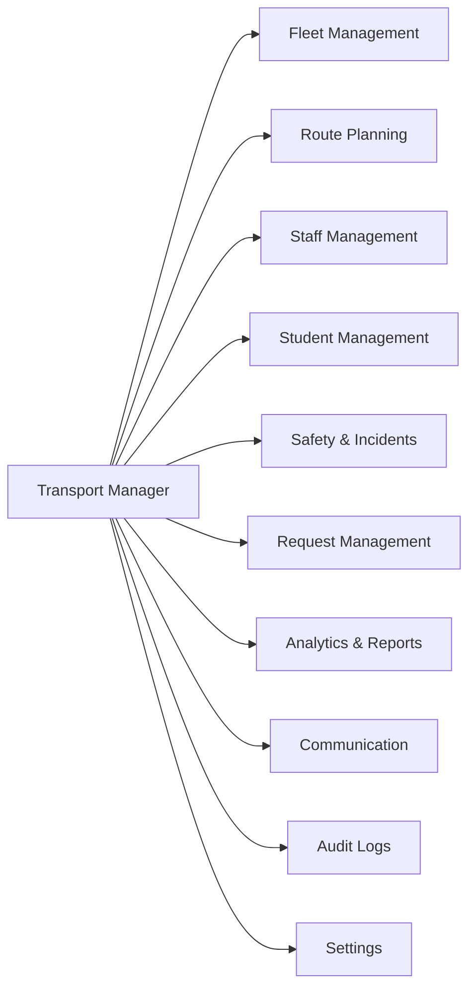
```mermaid
graph LR
    TM[Transport Manager] --> Fleet[Fleet Management]
    TM --> Routes[Route Planning]
    TM --> Staff[Staff Management]
    TM --> Students[Student Management]
    TM --> Safety[Safety & Incidents]
    TM --> Requests[Request Management]
    TM --> Reports[Analytics & Reports]
    TM --> Comm[Communication]
    TM --> Audit[Audit Logs]
    TM --> Settings[Settings]
```

</div>

**Key Features:**
- 🚌 **Fleet**: Vehicle inventory, maintenance, compliance
- 🗺️ **Routes**: Planning, monitoring, optimization
- 👥 **Staff**: Driver/assistant scheduling, assignments
- 👨‍🎓 **Students**: Assignments, attendance, change requests
- ⚠️ **Safety**: Incident reports, emergency management
- 📋 **Requests**: Route, student, fuel requests
- 📊 **Reports**: Operational, financial, compliance reports

#### 🚗 Driver
<div align="center">

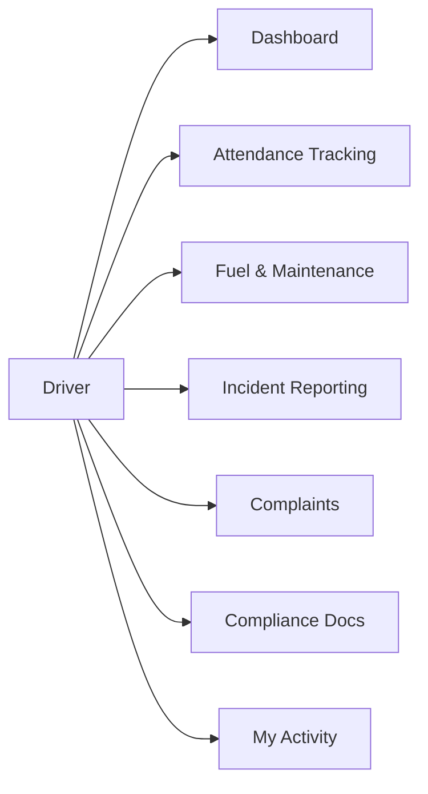
```mermaid
graph LR
    Driver[Driver] --> Dashboard[Dashboard]
    Driver --> Attendance[Attendance Tracking]
    Driver --> Fuel[Fuel & Maintenance]
    Driver --> Incidents[Incident Reporting]
    Driver --> Complaints[Complaints]
    Driver --> Compliance[Compliance Docs]
    Driver --> Activity[My Activity]
```

</div>

#### 🚐 Bus Assistant
<div align="center">

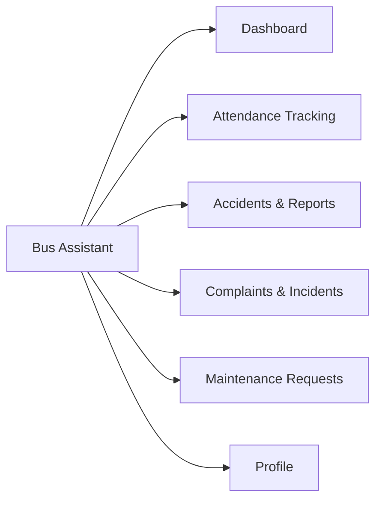
```mermaid
graph LR
    Assistant[Bus Assistant] --> Dashboard[Dashboard]
    Assistant --> Attendance[Attendance Tracking]
    Assistant --> Accidents[Accidents & Reports]
    Assistant --> Complaints[Complaints & Incidents]
    Assistant --> Maintenance[Maintenance Requests]
    Assistant --> Profile[Profile]
```

</div>

#### 👨‍👩 Parent
<div align="center">

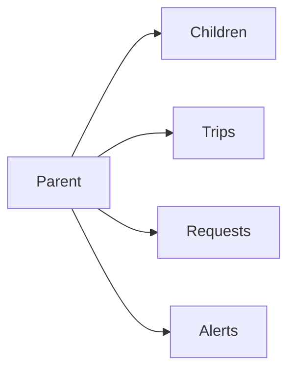
```mermaid
graph LR
    Parent[Parent] --> Children[Children]
    Parent --> Trips[Trips]
    Parent --> Requests[Requests]
    Parent --> Alerts[Alerts]
```

</div>

#### ⛽ Fuel Manager
<div align="center">

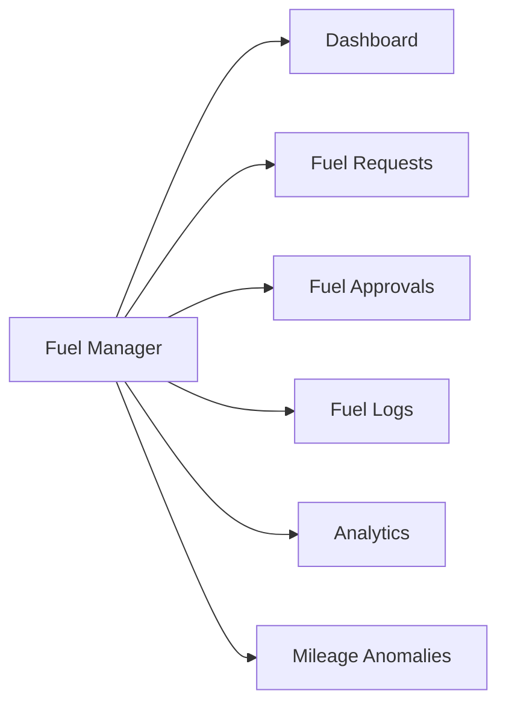
```mermaid
graph LR
    Fuel[Fuel Manager] --> Dashboard[Dashboard]
    Fuel --> Requests[Fuel Requests]
    Fuel --> Approvals[Fuel Approvals]
    Fuel --> Logs[Fuel Logs]
    Fuel --> Analytics[Analytics]
    Fuel --> Anomalies[Mileage Anomalies]
```

</div>

---

## 🔧 Tech Stack

### Frontend Stack

<div align="center">

| Technology | Version | Purpose |
|------------|---------|---------|
|  | 19.x | UI Framework |
|  | 5.x | Static Typing |
|  | 5.x | Build Tool |
|  | 6.x | Routing |
|  | 1.x | HTTP Client |
|  | Latest | Progressive Web App |

</div>

### Backend Stack

<div align="center">

| Technology | Version | Purpose |
|------------|---------|---------|
|  | 20.x | Runtime |
|  | 5.x | Web Framework |
|  | 8.x | Database |
|  | Latest | Authentication |
|  | Latest | Password Hashing |
|  | Latest | File Uploads |

</div>

### DevOps & Infrastructure

<div align="center">

| Technology | Purpose |
|------------|---------|
|  | Containerization |
|  | Reverse Proxy |
|  | Process Manager |
|  | File Storage |
|  | Caching |

</div>

---

## 🔐 Security

### Authentication Flow

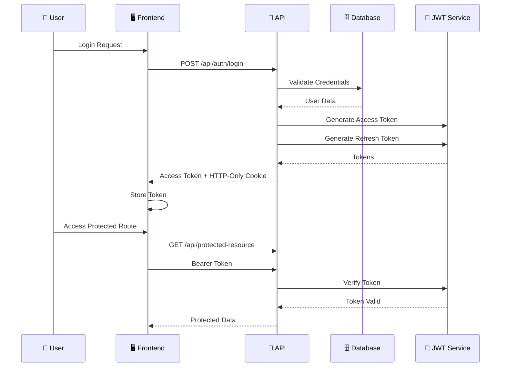
```mermaid
sequenceDiagram
    participant User as 👤 User
    participant Frontend as 🖥️ Frontend
    participant API as 🔌 API
    participant DB as 🗄️ Database
    participant JWT as 🔐 JWT Service
    
    User->>Frontend: Login Request
    Frontend->>API: POST /api/auth/login
    API->>DB: Validate Credentials
    DB-->>API: User Data
    API->>JWT: Generate Access Token
    API->>JWT: Generate Refresh Token
    JWT-->>API: Tokens
    API-->>Frontend: Access Token + HTTP-Only Cookie
    Frontend->>Frontend: Store Token
    
    User->>Frontend: Access Protected Route
    Frontend->>API: GET /api/protected-resource
    Frontend->>API: Bearer Token
    API->>JWT: Verify Token
    JWT-->>API: Token Valid
    API-->>Frontend: Protected Data
```

### Security Features

- 🔐 **JWT Authentication**: Secure token-based authentication
- 🍪 **HTTP-Only Cookies**: Refresh tokens stored securely
- 🛡️ **Role-Based Access Control**: Granular permissions per role
- 🔒 **Input Validation**: Request sanitization and validation
- 🚫 **SQL Injection Prevention**: Parameterized queries
- 🌐 **CORS Configuration**: Cross-origin resource sharing
- 📜 **Security Headers**: Helmet middleware for HTTP security
- 📝 **Audit Logging**: Complete audit trail of system changes

---

## 📊 Database Schema

### Entity Relationship Diagram

```mermaid
erDiagram
    USERS ||--o{ NUMBER_PLATES : "has"
    USERS ||--o{ INCIDENT_REPORTS : "reports"
    USERS ||--o{ COMPLAINT_REPORTS : "submits"
    USERS ||--o{ FUEL_MAINTENANCE_REQUESTS : "requests"
    USERS ||--o{ STUDENT_ROUTE_ASSIGNMENT : "manages"
    
    NUMBER_PLATES ||--o{ VEHICLE_ROUTE_ASSIGNMENTS : "assigned_to"
    ROUTES ||--o{ VEHICLE_ROUTE_ASSIGNMENTS : "assigned_to"
    ROUTES ||--o{ ROUTE_STOPS : "contains"
    ROUTES ||--o{ STUDENT_ROUTE_ASSIGNMENT : "for"
    
    STUDENTS ||--o{ STUDENT_ROUTE_ASSIGNMENT : "assigned_to"
    STUDENTS ||--o{ STUDENT_PARENT_CONTACT_CHANGES : "has"
    
    ACADEMIC_YEARS ||--o{ ACADEMIC_TERMS : "contains"
    ACADEMIC_YEARS ||--o{ CALENDAR_EVENTS : "has"
    
    TRIP_MONITORING ||--o{ TRIP_STOPS : "progresses_through"
    TRIP_MONITORING ||--o{ ATTENDANCE_RECORDS : "tracks"
    
    USERS {
        id INT PK
        email VARCHAR UNIQUE
        password_hash VARCHAR
        role ENUM
        first_name VARCHAR
        last_name VARCHAR
        created_at TIMESTAMP
    }
    
    NUMBER_PLATES {
        plate_number VARCHAR PK
        status ENUM
        created_at TIMESTAMP
    }
    
    ROUTES {
        id INT PK
        route_code VARCHAR UNIQUE
        route_name VARCHAR
        status ENUM
        created_at TIMESTAMP
    }
    
    VEHICLE_ROUTE_ASSIGNMENTS {
        id INT PK
        vehicle_plate VARCHAR FK
        route_id INT FK
        time_period ENUM
        status ENUM
        effective_from DATE
    }
    
    STUDENTS {
        id INT PK
        admission_number VARCHAR UNIQUE
        first_name VARCHAR
        last_name VARCHAR
        grade VARCHAR
        stream VARCHAR
    }
```

### Key Tables

| Table | Purpose | Key Fields |
|-------|---------|------------|
| `users` | User accounts | id, email, role, password_hash |
| `number_plates` | Vehicle registration | plate_number, status |
| `routes` | Route definitions | id, route_code, route_name, status |
| `route_stops` | Route stops | id, routeId, stopType, locationName |
| `vehicle_route_assignments` | Vehicle-route assignments | vehicle_plate, route_id, time_period |
| `students` | Student records | id, admission_number, grade, stream |
| `fuel_maintenance_requests` | Fuel/maintenance requests | id, requestType, status, amount |
| `incident_reports` | Incident documentation | id, incidentDate, description, status |
| `academic_years` | Academic year definitions | id, name, startDate, endDate |
| `calendar_events` | Calendar events | id, date, title, eventType, transportAvailable |

---

## 🚢 API Documentation

### API Endpoints Overview

<div align="center">

```mermaid
graph TB
    API[API Endpoints] --> Auth[/api/auth]
    API --> Transport[/api/transport-manager]
    API --> Parent[/api/parent]
    API --> Fuel[/api/fuel-maintenance]
    API --> Incidents[/api/incidents]
    API --> Complaints[/api/complaints]
    API --> Compliance[/api/compliance-documents]
    
    Auth --> Login[POST /login]
    Auth --> Register[POST /register]
    Auth --> Logout[POST /logout]
    Auth --> Me[GET /me]
    
    Transport --> Routes[GET /routes]
    Transport --> Vehicles[GET /vehicles]
    Transport --> Staff[GET /staff]
    Transport --> Students[GET /students]
    Transport --> Trips[GET /trips]
    Transport --> Requests[GET /parent-requests]
    
    Parent --> Children[GET /children]
    Parent --> Transport[GET /children/transport]
    Parent --> Requests[GET /transport-requests]
    
    Fuel --> Requests[GET /requests]
    Fuel --> Approvals[PATCH /requests/:id/status]
    
    Incidents --> Reports[GET /reports]
    Incidents --> AllReports[GET /all/reports]
    Incidents --> Status[PATCH /reports/:id/status]
    
    style API fill:#61DAFB
    style Auth fill:#4CAF50
    style Transport fill:#9C27B0
    style Parent fill:#FF9800
    style Fuel fill:#F44336
```

</div>

### Authentication Endpoints

| Method | Endpoint | Description | Auth Required |
|--------|----------|-------------|----------------|
| POST | `/api/auth/register` | Register new user | No |
| POST | `/api/auth/login` | Login user | No |
| POST | `/api/auth/logout` | Logout user | Yes |
| GET | `/api/auth/me` | Get current user | Yes |

### Transport Manager Endpoints

| Method | Endpoint | Description | Auth Required |
|--------|----------|-------------|----------------|
| GET | `/api/transport-manager/routes` | Get all routes | Transport Manager, School Admin |
| POST | `/api/transport-manager/routes` | Create new route | Transport Manager, School Admin |
| GET | `/api/transport-manager/vehicles` | Get all vehicles | Transport Manager, School Admin |
| GET | `/api/transport-manager/staff` | Get all staff | Transport Manager, School Admin |
| GET | `/api/transport-manager/students` | Get all students | Transport Manager, School Admin |
| GET | `/api/transport-manager/trips` | Get all trips | Transport Manager, School Admin |
| GET | `/api/transport-manager/parent-requests` | Get parent requests | Transport Manager, School Admin |

### Fuel Management Endpoints

| Method | Endpoint | Description | Auth Required |
|--------|----------|-------------|----------------|
| GET | `/api/fuel-maintenance/requests` | Get all requests | Driver, Assistant, TM, FM, SA |
| POST | `/api/fuel-maintenance/requests` | Create request | Driver, Assistant, FM |
| PATCH | `/api/fuel-maintenance/requests/:id/status` | Update status | TM, FM, SA |

---

## 🧪 Testing

### Test Coverage

<div align="center">

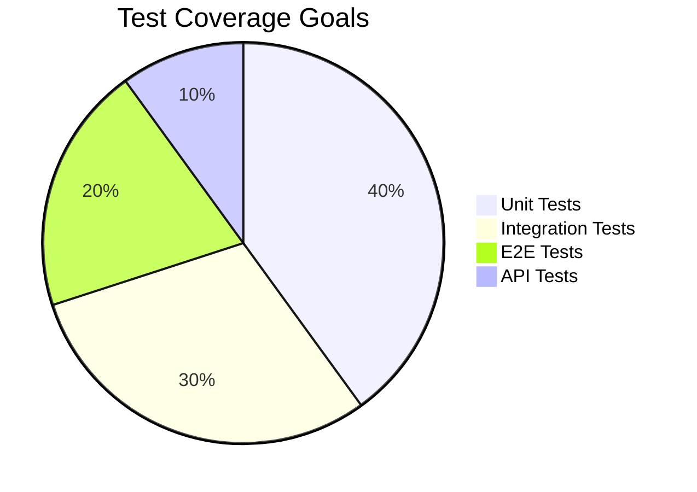
```mermaid
pie title Test Coverage Goals
    "Unit Tests" : 40
    "Integration Tests" : 30
    "E2E Tests" : 20
    "API Tests" : 10
```

</div>

### Running Tests

```bash
# Backend tests
cd backend
npm test

# Frontend tests
cd frontend
npm test

# E2E tests
npm run test:e2e
```

---

## 📦 Deployment

### Deployment Architecture

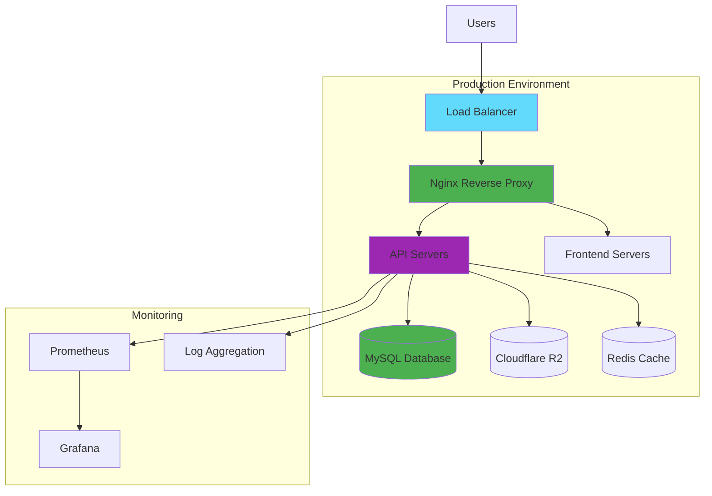
```mermaid
graph TB
    subgraph "Production Environment"
        LB[Load Balancer]
        Nginx[Nginx Reverse Proxy]
        API[API Servers]
        FE[Frontend Servers]
        DB[(MySQL Database)]
        R2[(Cloudflare R2)]
        Redis[(Redis Cache)]
    end
    
    subgraph "Monitoring"
        Prometheus[Prometheus]
        Grafana[Grafana]
        Logs[Log Aggregation]
    end
    
    User[Users] --> LB
    LB --> Nginx
    Nginx --> API
    Nginx --> FE
    API --> DB
    API --> R2
    API --> Redis
    API --> Prometheus
    Prometheus --> Grafana
    API --> Logs
    
    style LB fill:#61DAFB
    style Nginx fill:#4CAF50
    style API fill:#9C27B0
    style DB fill:#4CAF50
```

### Deployment Steps

#### 1. Docker Deployment

```bash
# Build and start containers
docker-compose up -d

# View logs
docker-compose logs -f

# Stop containers
docker-compose down
```

#### 2. Manual Deployment

```bash
# Backend
cd backend
npm run build
pm2 start server.js --name soho-backend

# Frontend
cd frontend
npm run build
pm2 start "serve -s dist -l 3000" --name soho-frontend
```

#### 3. Environment Configuration

**Production .env Example:**
```env
NODE_ENV=production
PORT=5000
DB_HOST=production-db-host
DB_USER=production-user
DB_PASSWORD=secure-password
DB_NAME=Soho_Academy
JWT_SECRET=strong-production-secret
FRONTEND_ORIGIN=https://your-domain.com
R2_ACCOUNT_ID=your-account-id
R2_ACCESS_KEY_ID=your-access-key
R2_SECRET_ACCESS_KEY=your-secret-key
R2_BUCKET_NAME=your-bucket
```

---

## 🤝 Contributing

### Contribution Guidelines

1. **Fork the repository**
2. **Create a feature branch** (`git checkout -b feature/amazing-feature`)
3. **Commit your changes** (`git commit -m 'Add amazing feature'`)
4. **Push to the branch** (`git push origin feature/amazing-feature`)
5. **Open a Pull Request**

### Code Style

- Follow existing code patterns
- Use TypeScript for all new components
- Add proper type definitions
- Write meaningful commit messages
- Add comments for complex logic

---

## 📄 License

This project is licensed under the MIT License - see the LICENSE file for details.

---

## 🙏 Acknowledgments

- Built with ❤️ for school transport management
- Powered by modern web technologies
- Designed for safety and efficiency

---

<div align="center">

**Made with ❤️ by the Soho Team**

[⭐ Star us on GitHub](https://github.com/DeCLAN-designs/Soho_Academy)
[🐛 Report Issues](https://github.com/DeCLAN-designs/Soho_Academy/issues)
[📖 Documentation](https://github.com/DeCLAN-designs/Soho_Academy/wiki)

</div>
