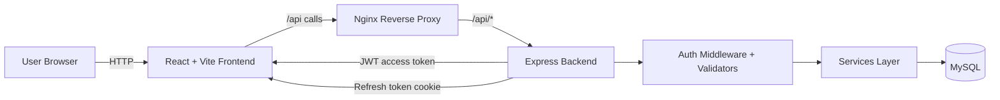
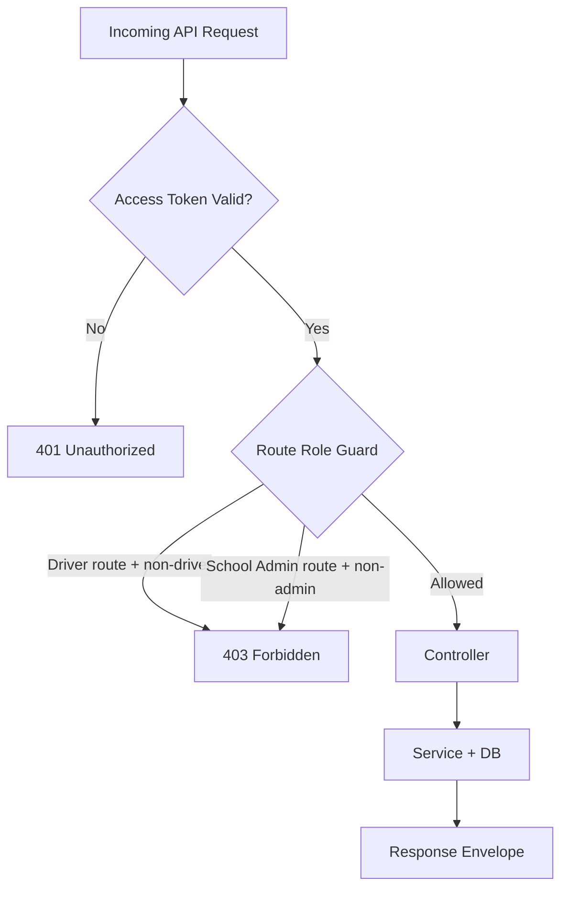
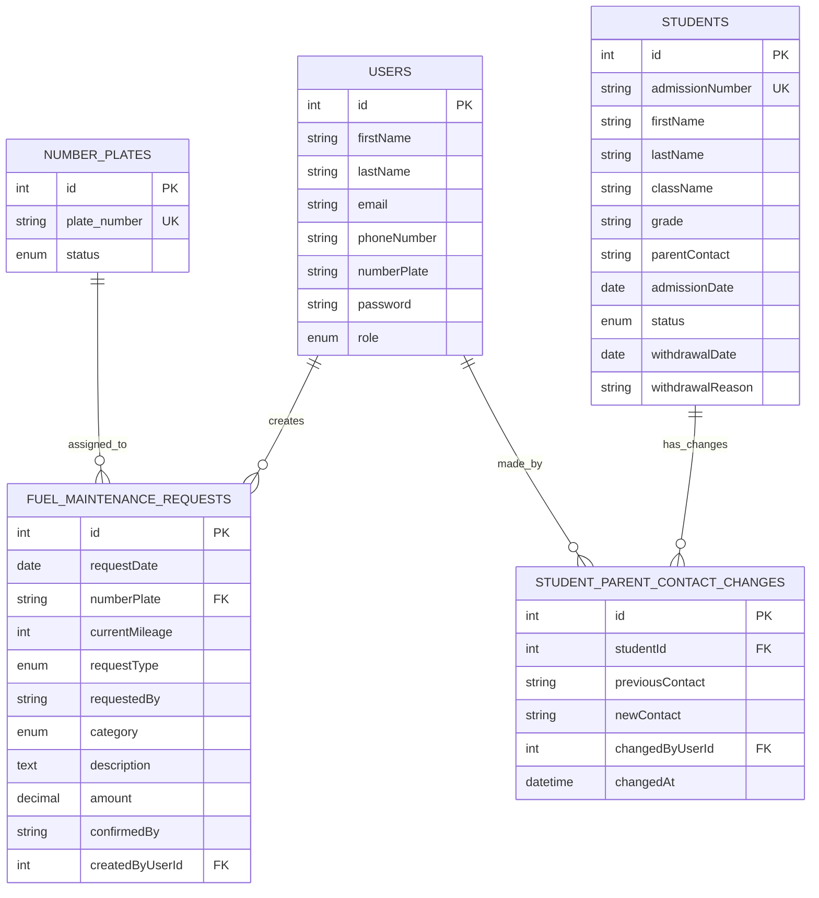

# Architecture Diagrams

## 1) Request and Control Flow

```mermaid
flowchart LR
    U[User Browser] -->|HTTP| FE[React + Vite Frontend]
    FE -->|/api calls| NG[Nginx Reverse Proxy]
    NG -->|/api/*| BE[Express Backend]
    BE --> AUTH[Auth Middleware + Validators]
    AUTH --> SVC[Services Layer]
    SVC --> DB[(MySQL)]

    BE -->|JWT access token| FE
    BE -->|Refresh token cookie| FE
```

## 2) Role-Based Access (Backend)

```mermaid
flowchart TD
    A[Incoming API Request] --> B{Access Token Valid?}
    B -- No --> R401[401 Unauthorized]
    B -- Yes --> C{Route Role Guard}
    C -- Driver route + non-driver --> R403[403 Forbidden]
    C -- School Admin route + non-admin --> R403
    C -- Allowed --> D[Controller]
    D --> E[Service + DB]
    E --> F[Response Envelope]
```

## 3) Database Relationship Diagram

```mermaid
erDiagram
    USERS {
      int id PK
      string firstName
      string lastName
      string email
      string phoneNumber
      string numberPlate
      string password
      enum role
    }

    NUMBER_PLATES {
      int id PK
      string plate_number UK
      enum status
    }

    FUEL_MAINTENANCE_REQUESTS {
      int id PK
      date requestDate
      string numberPlate FK
      int currentMileage
      enum requestType
      string requestedBy
      enum category
      text description
      decimal amount
      string confirmedBy
      int createdByUserId FK
    }

    STUDENTS {
      int id PK
      string admissionNumber UK
      string firstName
      string lastName
      string className
      string grade
      string parentContact
      date admissionDate
      enum status
      date withdrawalDate
      string withdrawalReason
    }

    STUDENT_PARENT_CONTACT_CHANGES {
      int id PK
      int studentId FK
      string previousContact
      string newContact
      int changedByUserId FK
      datetime changedAt
    }

    USERS ||--o{ FUEL_MAINTENANCE_REQUESTS : creates
    NUMBER_PLATES ||--o{ FUEL_MAINTENANCE_REQUESTS : assigned_to
    STUDENTS ||--o{ STUDENT_PARENT_CONTACT_CHANGES : has_changes
    USERS ||--o{ STUDENT_PARENT_CONTACT_CHANGES : made_by
```
